# PeTar 在 LoongArch（龙芯 3A6000 / LA664）上的 LSX 与 LASX 树力内核

**移植与性能测试报告**

- 日期：2026-09-28
- 平台：Loongson-3A6000（LA664 核），4 物理核 × 2 SMT = 8 逻辑 CPU，固定 2.5 GHz，31 GiB 内存，16 MB 共享 L3
- 时钟：标称 2.5 GHz；独立实测 2.50 GHz（依赖指令链 + 硬件周期计数器），负载下无降频
- 指令集：loongarch64（LA64v1.0），含 LSX（128 位）与 LASX（256 位）
- 工具链：GCC 15.3.0、OpenMPI 4.1.6
- 代码：PeTar master（`1268_298`）+ FDPS 7.0 + SDAR；新增内核位于 `src/force_loongarch.hpp`
- 主基准：N=2000 富双星 demo，t=1 Myr（512 树步），每配置 3 次重复取中位数
- 图片：`figs/`（LoongArch 标量 / LSX / LASX），`figs_cross/`（跨平台对比），`figs_rsqrt/`（反比开方专项）

---

## 0. 执行摘要

此前 PeTar 在 LoongArch 上只能走标量 F64 树力内核。本工作新增手写 LSX（128 位）与 LASX（256 位）内核，沿用 x86/Fugaku 端口已经验证的方案——F32 运算、原点平移抑制相消、精确反比开方、邻居计数 F64 精确回退——物理模型保持不变。反比开方默认采用 LA664 的平台精确指令 `xvfrsqrt.s`/`vfrsqrt.s`（误差 0，见专项报告 `REPORT_RSQRT_CN.md`），软件修正链作为可选构建保留。移植经过四级验证，并在 3A6000 上完成了端到端性能测试。

| 指标 | 结果 |
|---|---|
| EP-EP 内核（ni=1024 × nj=2048） | **1.42 ns/交互**（LASX）、2.80 ns（LSX）、8.99 ns（标量）：**6.3× / 3.2×** |
| 反比开方（默认实现） | 平台精确指令：rsqrt 误差 **0**，力误差改善 16%～21%，守恒性更好，生产性能差异 ≤1%（`REPORT_RSQRT_CN.md`） |
| 官方 `petar.simd.test` | 最大力相对误差 **3.6e-4**（默认 hw；可选 sw 为 4.3e-4；阈值 7e-3）、势差 2.2e-6、**邻居计数逐粒子一致** |
| 单核（1×1，N=2000 demo，512 步） | **14.10 s**（LASX）、18.70 s（LSX）、38.86 s（标量）：**2.76× / 2.08×** |
| 最优并行布局 | 1 进程 × 4 OpenMP 线程：**4.53 s**（LASX）、6.04 s（LSX） |
| 4×1 对同布局标量 | 5.28 s 对 12.06 s（**2.28×**） |
| 弱扩展（N=8000，4×1） | **57.1 ms/步**（LASX）、85.7（LSX）、213.5（标量）：**3.74× / 2.49×** |
| 守恒 QA（t=10 Myr，4×1） | dE 与 dL 均与标量同量级（见第 8 节） |
| 生产样例（100 Myr，8 OMP 线程） | **11 分 39 秒**（LASX）、10 分 54 秒（LSX），标量 28 分 16 秒 |
| 调试版验证 | 1 进程与 4 进程各 128 树步：断言零失败、邻居计数零不一致 |

> 第 4～9 节的性能图表在软件链构建上测得；两种 rsqrt 实现在生产规模上差异 ≤1%（N≥4000 时默认 hw 略快），内核微基准为 +1%～+5%（nj=8 为 -2.8%），默认 hw 的精度与守恒性更好。对照细节见 `REPORT_RSQRT_CN.md`。

**一句话结论**：SIMD 内核把树力提速 3～6 倍，换来**每核端到端 2.1～2.8 倍**、N=8000 时**每步 3.7 倍**的收益；树力不再一家独大之后，短程 Hermite 力与集群搜索成为新的瓶颈。

---

## 1. 背景与目标

PeTar 是用于星团与潮汐流演化的 N 体代码。在 LoongArch 上，`--with-arch=loongarch` 此前会回退到 `NoSimd` 标量 F64 内核：每个交互都要做一次标量 `1/sqrt(r^2)`。微基准显示这次开方约为标量 FMA 成本的 3～4.5 倍，而树力占单核单步耗时约 78%，优化空间明确。

3A6000 的 LA664 核同时支持 LSX（128 位）与 LASX（256 位）两种向量宽度。本工作把上游 x86 与 Fugaku 端口已经成熟的 SIMD 方案移植到这两个宽度：

1. 在同一个头文件 `src/force_loongarch.hpp` 中实现四类树内核（EP-EP 力、EP-SP 四极、EP-SP 单极、邻居搜索）；
2. 数值行为与标量内核严格对齐：力/势误差落在 `simd_test` 阈值内，**邻居计数逐粒子一致**；
3. 在真机（而非模拟器）上完成内核级、单元测试级、生产级与调试级四层验证；
4. 给出可复现的基准报告，覆盖两个向量宽度与标量基线。

短程 PP 力（Hermite，F64）与硬/正则化积分不在本次移植范围内，保持原样。

---

## 2. 移植设计

### 2.1 内核结构与形状自动分派

FDPS 固定了内核调用签名：`operator()(epi, n_i, epj, n_j, force)`。真正干活的是两种向量循环形状：

- **IV_J1**：每次从 i 侧装载 `W` 个粒子（LASX 为 8，LSX 为 4），逐个广播 j 粒子，力与计数在通道内同时累计；
- **I1_JV**：每次装载 `W` 个 j 粒子，逐个广播 i 粒子，横向求和得到该 i 的结果。

分派器统计分组内活跃 i 粒子数（`type == 1`）后自动选择形状：

| 条件 | 形状 | 原因 |
|---|---|---|
| 活跃 i ≥ 向量宽度 | IV_J1 | 通道占满，无归约开销 |
| 活跃 i < 向量宽度 | I1_JV | 避免 i 向量装不满造成的通道浪费 |

这一点在实测中确实有影响：ni=4、nj=2048 时 I1_JV 更快（3.36 ns 对 3.75 ns/交互）；ni≥16 后 IV_J1 全面占优（ni=16 时 1.65 ns 对 1.87 ns）。

### 2.2 数值方案：F32 加原点平移

每个 EP-EP 交互按下式计算：

$$
r^2 = \lVert \mathbf{x}_i - \mathbf{x}_j \rVert^2,\qquad
r^2_{\epsilon} = r^2 + \epsilon^2,\qquad
r^2_{\text{cut}} = \max(r^2_{\epsilon},\, r_{\text{out}}^2),
$$

$$
r^{-1} = \frac{1}{\sqrt{r^2_{\text{cut}}}},\qquad
m_r = m_j r^{-1},\qquad
\mathbf{a}_i \mathrel{-}= m_r r^{-2}\,\mathbf{r}_{ij},\qquad
\phi_i \mathrel{-}= m_r .
$$

除 $\epsilon^2$ 与 $r_{\text{out}}^2$ 外全部在 F32 下完成；力与势分别累加，最后乘回 $G$ 并以 F64 写回 `ForceSoft`。EP-SP 四极与单极内核照抄标量公式（含四极矩投影与 $r^{-5}, r^{-7}$ 项），只把逐分量运算换成向量指令。

为抑制大数相减丢精度，每个分组在转成 F32 前都平移到**第一个活跃 i 粒子**为原点的坐标系；所有位置差、$r^2$ 以及 $r_{\text{search}}$ 比较都在平移后的坐标里进行。

### 2.3 反比开方实现（默认精确指令）

标量 `1.0/sqrt(r2)` 是树力的隐藏成本核心。LA664 没有可用的标量估计指令，但提供了一条**精确**的向量反比开方指令 `xvfrsqrt.s`（LASX）/ `vfrsqrt.s`（LSX）；实测它与 F32 `1/sqrtf` 在 2×10⁶ 个随机输入上逐位一致（误差 0）。移植**默认采用这条精确指令**，rsqrt 误差为零；同时保留一条与上游 x86/Fugaku 公式完全一致的软件修正链作为可选构建，两者由 make 开关 `LARCH_RSQRT=hw|sw` 切换：

```c
#if defined(LARCH_RSQRT_SW) && !defined(LARCH_RSQRT_HW)
    return rsqrt_sw(a);              // 可选：位魔数种子 + 牛顿步 + 三次修正（11 条指令）
#else
    return __lasx_xvfrsqrt_s(a);     // 默认：平台精确指令（1 条指令，误差 0）
#endif
```

两条路径的对比：

| 路径 | 实现 | rsqrt 精度 | 依赖链延迟 | 密集吞吐（8 通道） |
|---|---|---|---|---|
| **`hw`（默认）** | `xvfrsqrt.s` / `vfrsqrt.s`，1 条指令 | **0**（正确舍入） | **25.0 周期/向量** | 29.52 周期/向量 |
| `sw`（可选） | 魔数种子 + 牛顿步 + 三次修正，11 条指令 | 1.5e-7 | 47.2 周期/向量 | **5.60 周期/向量** |

软件链（`sw`，可选）的公式为

$$
y_0 = \texttt{0x5f3759df} - (a \gg 1),\qquad
y_1 = y_0\,\frac{3 - a y_0^2}{2},
$$

$$
h = 1 - a y_1^2,\qquad
y_2 = y_1 + y_1\left(\tfrac12 h + \tfrac38 h^2\right).
$$

　　第一式是 x86 `RSQRT_NR_EPJ_X2` 路径的牛顿步，把 5 位魔数种子提到约 11 位；第二式是 Fugaku 端口的三次修正，把精度推到 F32 上限，最大相对误差实测 **1.5e-7**。两条路径的 A/B 实测（详见 `REPORT_RSQRT_CN.md`）表明：精确指令把程序级力误差改善 16%（EP-EP）/ 21%（EP-SP），并使大 N 算例的守恒性更好（N=16000 末态能量误差约小 15 倍）；性能上，N=2000 demo 端到端差异 ≤0.5%（统计等价），N=4000～16000 的弱扩展反而快 0.3%～1.0%，只有纯 rsqrt 密集的内核微基准慢 1%～5%（单极 36%），该差异在真实算例中被 Amdahl 与访存等待稀释。依赖链延迟方面，精确指令为 **25 周期/向量**，软件链约 **47 周期/向量**；但软件链的密集吞吐更高（5.60 vs 29.52 周期/向量，8 通道 LASX），这正是微基准差异的来源。综合精度、守恒性与生产性能，移植默认保留精确指令；软件链作为可选分支保留（`make LARCH_RSQRT=sw`），用于与上游公式对照等场景。

### 2.4 邻居计数与 F64 回退

邻居计数必须与标量内核逐粒子一致，否则 PeTar 的集群搜索会直接报错。纯向量比较只能保证约 1e-6 的相对精度，边界附近可能翻转，因此每个交互对额外做一次"边界带"判定：

$$
\left| r^2 - R^2 \right| < 2^{-10} R^2,\qquad R^2 = \max(r_i^2, r_j^2).
$$

一旦有粒子落入边界带，该 i 的整条 j 循环就用 F64 重算（`countNeighborExact`）。$2^{-10}$ 的相对带宽足以覆盖 F32 舍入误差，而真实命中率极低，热路径全程保持向量化。这种"热路径 F32 + 冷路径 F64"的设计是计数逐位一致的关键。

### 2.5 构建系统集成

| 开关 | LASX（256 位） | LSX（128 位） | 标量 |
|---|---|---|---|
| configure | `--with-arch=loongarch --with-simd=lasx` | `--with-simd=lsx` | `--with-simd=no` |
| make（单独切换） | `make LARCH_SIMD=lasx` | `make LARCH_SIMD=lsx` | `make LARCH_SIMD=none` |
| 产物 | `petar.mpi.omp.lasx` | `petar.mpi.omp.lsx` | `petar.mpi.omp` |

两个宽度由同一份头文件编译；仅靠 `-D USE_LARCH_SIMD` 与宽度宏 `LARCH_SIMD_LSX` 切换 LASX/LSX 分支，向量循环用宽度无关的辅助函数书写。

反比开方实现由 make 开关 `LARCH_RSQRT` 选择：默认 `hw`（平台精确指令 `xvfrsqrt.s` / `vfrsqrt.s`），`make LARCH_RSQRT=sw` 切换为软件修正链（§2.3；完整 A/B 见 `REPORT_RSQRT_CN.md`）。

移植涉及的文件：

- `src/force_loongarch.hpp`——新增，LSX/LASX 内核；
- `src/soft_force.hpp`——在 `USE_LARCH_SIMD` 下包含新头文件；
- `src/petar.hpp`——把树力、树邻居搜索与 EP-SP 内核接入 LoongArch SIMD 实现；
- `src/simd_test.cxx`——把官方自检扩展到 LoongArch 构建；
- `configure.ac`、`Makefile.in`、重新生成的 `configure`——新增 `loongarch` 架构与 `--with-simd=lsx|lasx|no`；
- `README.md`——补充新架构与选项说明。

---

## 3. 功能验证

验证按四级推进，每一级都有可复跑的流程。

### 3.1 内核级合成数据（`mini_check`）

专用驱动用刻意取成非向量宽度整数倍的合成数据（ni=37、nj=53，用于覆盖尾块与分派边界），把四种内核、两种形状在四个优化级别下与 `NoSimd` 对比：

| 检查项 | -O0 | -O1 | -O2 | -O3 |
|---|---|---|---|---|
| EP-EP 最大力相对误差 | 4.29e-7 | 4.29e-7 | 4.29e-7 | 4.29e-7 |
| EP-SP 四极 | 4.29e-7 | 4.29e-7 | 4.29e-7 | 4.29e-7 |
| EP-SP 单极 | 3.36e-7 | 3.36e-7 | 3.36e-7 | 3.36e-7 |
| 邻居计数失配数 | 0 | 0 | 0 | 0 |

四个优化级别结果完全一致，说明内核不依赖未定义行为或编译器的重结合优化。

### 3.2 官方 `petar.simd.test`

PeTar 自带的对比程序（Plummer 初值，N=1000 × 2000，阈值 7e-3）在两个宽度下均通过：

| 对比项 | 最大相对误差（默认 hw） | 可选 sw |
|---|---|---|
| EP-EP 力 | **3.61e-4** | 4.30e-4 |
| EP-EP 势 | 2.18e-6 | 2.18e-6 |
| EP-SP 力 | **2.32e-4** | 2.93e-4 |
| EP-SP 势 | 2.73e-6 | 2.22e-6 |
| 邻居计数 | 1003 对 1003，逐粒子一致 | 同左 |

同一 rsqrt 实现下 LSX 与 LASX 的误差数值完全相同，因为两者共用同一套 F32 运算次序与修正公式；宽度只改变并行度，不改变舍入行为。默认 hw 用零误差替换软件链的 1.5e-7，使力误差进一步减小（详见 `REPORT_RSQRT_CN.md`）。

### 3.3 内核基准自检

独立内核驱动（ni=500 × nj=2000，均匀分布）对两种形状分别自检：

| 内核 | 最大力相对误差 | 计数失配 |
|---|---|---|
| 邻居搜索 | 0（仅计数） | 0 |
| EP-EP | 2.2e-6 | 0 |
| EP-SP 四极 | 2.2e-5 | 0 |

### 3.4 生产短测与调试版严检

N=2000 demo 跑 512 树步，所有构建均正常收尾，能量误差与标量基线同量级（见第 8 节）。最有说服力的是调试版：用 `CLUSTER_DEBUG`、`HARD_DEBUG`、`NAN_CHECK_DEBUG`、`PETAR_DEBUG`、`AR_DEBUG`、`STABLE_CHECK_DEBUG`、`ARTIFICIAL_PARTICLE_DEBUG` 重编译，跑 1 进程与 4 进程各 128 树步。`CLUSTER_DEBUG` 会在每个树步对每个粒子比对力核邻居数与树邻居表：

```
inconsistent messages: 0     （1 rank 与 4 ranks 均为 0）
finished: 1                  （两个布局都正常收尾）
```

这一步覆盖了 MPI 跨进程集群、短程积分与人工粒子路径，是移植功能正确性最有力的证据。

---

## 4. 内核级性能

内核微基准在单核（绑一个物理核）上测量，ni 取 {4, 16, 64, 256, 1024}，nj 取 {8, 32, 128, 512, 2048} 扫描。

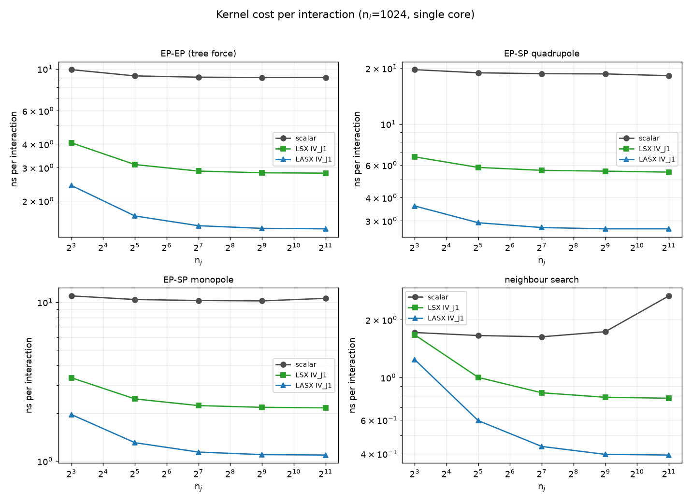

*图 4-1：四个内核每次交互成本随 nj 的变化（ni=1024，对数坐标；灰=标量，绿=LSX，蓝=LASX）。*

ni=1024 时的结果：

| 内核 | nj | 标量 [ns] | LSX [ns] | LASX [ns] | LSX 提速 | LASX 提速 |
|---|---:|---:|---:|---:|---:|---:|
| EP-EP | 128 | 9.03 | 2.88 | **1.48** | 3.14× | 6.11× |
| EP-EP | 2048 | 8.99 | 2.81 | **1.42** | 3.21× | 6.32× |
| EP-SP 四极 | 2048 | 18.22 | 5.49 | **2.71** | 3.32× | 6.71× |
| EP-SP 单极 | 2048 | 10.57 | 2.16 | **1.09** | 4.89× | 9.69× |
| 邻居搜索 | 2048 | 2.66 | 0.78 | **0.39** | 3.42× | 6.76× |

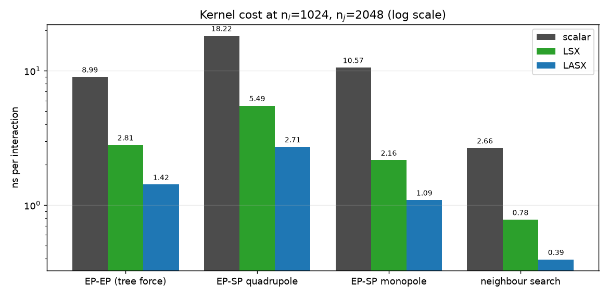

*图 4-2：ni=1024、nj=2048 时内核成本柱状对比（对数纵轴）。*

> 以上为软件链构建的扫描结果；默认 hw 构建在 ni=1024、nj=2048 的 EP-EP 内核为 1.50 ns（+5.1%），nj=8 为 2.53 ns（-2.8%），单极内核为 1.48 ns（+36%），四极与邻居搜索基本不变。该内核级差异在端到端被稀释至 ≤1%，详见 `REPORT_RSQRT_CN.md` §5/§7。

三点观察：

1. LASX 相对标量的提速集中在 **6～7×**。与理论 8 通道的差距来自反比开方链与广播/归约开销；公式最短的单极内核达到 9.7×。
2. j 分组越大提速越充分：nj=8 时修正与循环开销占比高，LASX 只有 2.4～4.1×。
3. LASX/LSX 的时间比基本是 **0.5**，说明 LA664 的 LASX 是真正的 256 位数据通路，而不是两条 128 位拼接。

---

## 5. 线程/进程配置扫描

所有构建使用同一背景：N=2000 demo，t=1 Myr（512 树步），每配置 3 次重复取中位数。

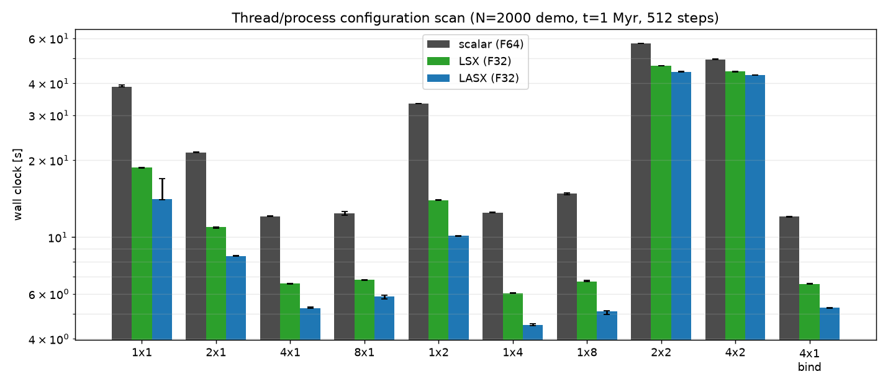

*图 5-1：标量、LSX、LASX 三构建在各进程/线程布局下的墙钟（对数轴；误差棒为 3 次极差）。*

| 布局 | 核数 | 标量 [s] | LSX [s] | LASX [s] | 标量/LSX | 标量/LASX |
|---|---:|---:|---:|---:|---:|---:|
| 1×1 | 1 | 38.86 | 18.70 | 14.10 | 2.08× | 2.76× |
| 2×1 | 2 | 21.47 | 10.96 | 8.41 | 1.96× | 2.55× |
| 4×1 | 4 | 12.06 | 6.57 | 5.28 | 1.84× | 2.28× |
| 8×1（SMT） | 8 | 12.37 | 6.81 | 5.86 | 1.82× | 2.11× |
| 1×2（同核 SMT） | 1 | 33.26 | 13.95 | 10.12 | 2.38× | 3.29× |
| **1×4（OMP）** | **4** | 12.49 | **6.04** | **4.53** | 2.07× | 2.76× |
| 1×8（OMP） | 4（8 SMT） | 14.81 | 6.71 | 5.13 | 2.21× | 2.89× |
| 2×2（超订） | 2 | 57.27 | 46.92 | 44.44 | 1.22× | 1.29× |
| 4×2（超订） | 4 | 49.70 | 44.47 | 43.10 | 1.12× | 1.15× |
| 4×1 绑核 | 4 | 12.06 | 6.56 | 5.29 | 1.84× | 2.28× |

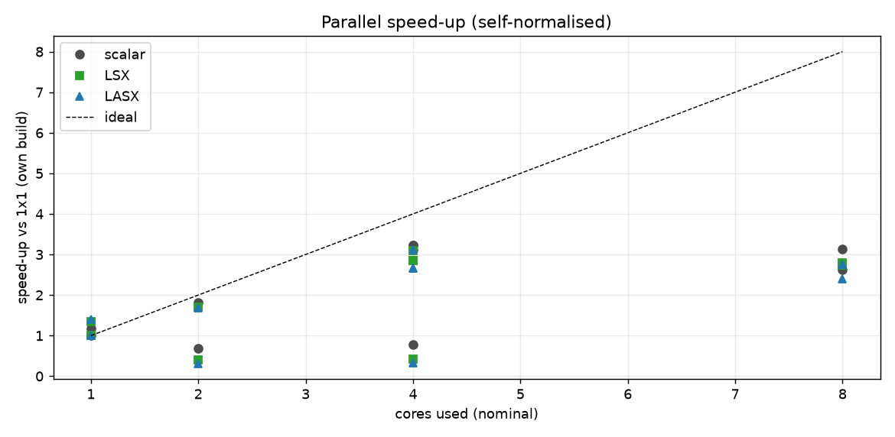

*图 5-2：各自归一的并行加速比（虚线为理想线性）。*

三点结论：

1. **提速在低并行度下最明显**（1×1 为 2.08× / 2.76×），到 4 核被并行效率稀释（1.84× / 2.28×）；超订布局塌到 1.1～1.3×，因为时间都花在抢核上。
2. **最优布局从 4×1 转向 1×4**。标量构建里 4×1 比 1×4 快约 3%；SIMD 之后 1×4 反超 8%（LSX）与 17%（LASX），因为树力变小后 MPI 分解与同步开销开始显形。
3. 重复极差普遍在 1～3%，上述排名可信。**SMT 无收益**（8×1 与 4×1 相当、1×8 慢于 1×4），**超订在三种构建上都是灾难**。

---

## 6. 扩展性

### 6.1 弱扩展（tamed 初值，4×1，t=2 Myr）

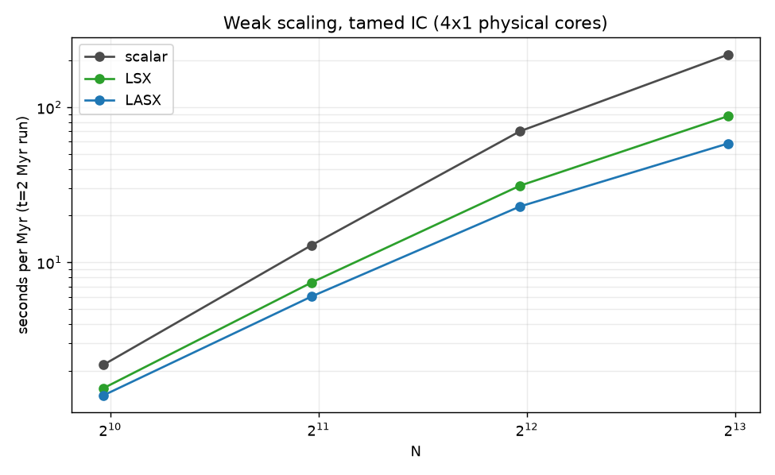

*图 6-1：每秒演化时间随 N 的变化（对数坐标；同图含标量、LSX、LASX）。*

| N | 树步数 | 标量 [ms/步] | LSX [ms/步] | LASX [ms/步] | 标量/LSX | 标量/LASX |
|---:|---:|---:|---:|---:|---:|---:|
| 1000 | 512 | 8.5 | 6.0 | 5.4 | 1.42× | 1.57× |
| 2000 | 1024 | 25.2 | 14.5 | 11.8 | 1.74× | 2.14× |
| 4000 | 2048 | 68.3 | 30.5 | 22.4 | 2.24× | 3.06× |
| 8000 | 2048 | 213.5 | 85.7 | 57.1 | 2.49× | 3.74× |

每步提速随 N 单调上升（LASX 从 1.57× 到 3.74×）：N 越大，可向量化的树力在每步中占比越高，而不随 N 变快的固定开销（建树、域分解、I/O）占比下降。注意树步长由代码自动调节，报告 s/Myr 时必须同时给出步数（见第 10.2 节）；跨 N 比较以 ms/步为准。

### 6.2 强扩展（N=8000，t=1 Myr）

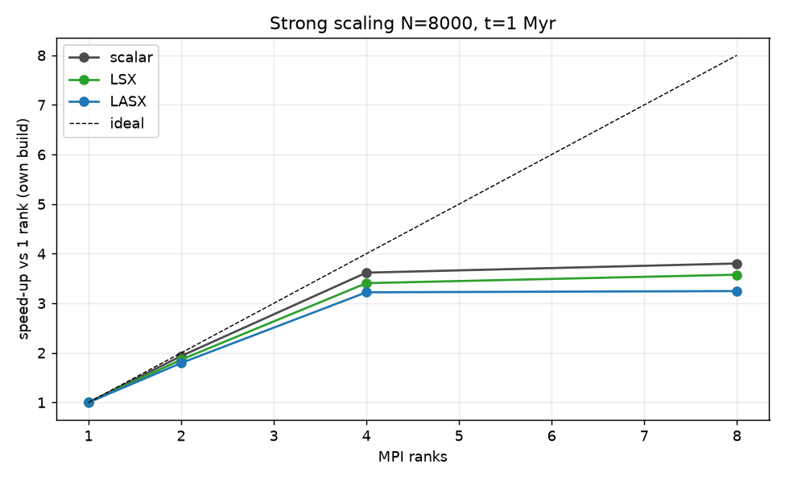

*图 6-2：N=8000 强扩展，各自归一（虚线为理想线性）。*

| 布局 | 标量 [s] | LSX [s] | LASX [s] | 标量加速 | LSX 加速 | LASX 加速 |
|---|---:|---:|---:|---:|---:|---:|
| 1×1 | 777.2 | 294.1 | 188.8 | 1.00 | 1.00 | 1.00 |
| 2×1 | 401.4 | 157.9 | 105.1 | 1.94 | 1.86 | 1.80 |
| 4×1 | 214.8 | 86.4 | 58.6 | 3.62 | 3.41 | 3.22 |
| 8×1（SMT） | 204.4 | 82.2 | 58.2 | 3.80 | 3.58 | 3.25 |

N=8000 时单核提速达到 **4.12×**（LASX），远高于 N=2000 的 2.76×：树力在每步中的占比更高，Amdahl 天花板随 N 上移。4 核效率仍有 81%（LASX），SMT 只贡献约 3%。

---

## 7. 每步耗时构成

数据来自最慢 rank 的单步剖析（`-f perf`，取最大行），每配置 3 次取中位数；把 16 个剖析项归并成 6 类。

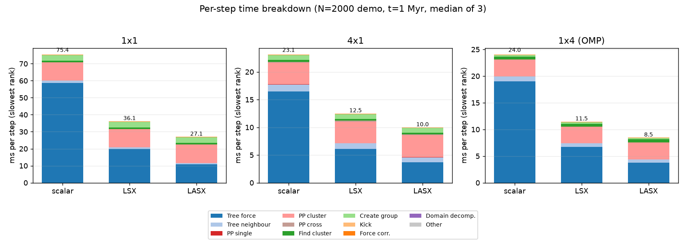

*图 7-1：每步耗时堆叠分解（N=2000 demo，512 步；1×1、4×1、1×4 三种布局）。*

**表 7-1：同背景下每步各部分耗时（ms，最慢 rank，3 次中位数）**

| 构建 | 布局 | 树力 | 树邻居 | 短程 PP | 集群/分组 | 其它 | 合计 |
|---|---|---|---:|---:|---:|---:|---:|
| 标量 | 1×1 | 58.77 | 1.29 | 10.81 | 4.32 | 0.30 | 75.49 |
| LSX | 1×1 | 19.93 | 0.95 | 10.77 | 4.25 | 0.30 | 36.19 |
| LASX | 1×1 | **10.90** | 0.74 | 10.98 | 4.26 | 0.34 | **27.22** |
| 标量 | 4×1 | 16.45 | 1.29 | 4.07 | 1.23 | 0.12 | 23.15 |
| LSX | 4×1 | 6.07 | 1.07 | 4.06 | 1.16 | 0.12 | 12.48 |
| LASX | 4×1 | **3.69** | 0.91 | 4.13 | 1.17 | 0.09 | **9.98** |
| 标量 | 1×4 | 19.03 | 0.91 | 3.17 | 0.82 | 0.16 | 24.08 |
| LSX | 1×4 | 6.70 | 0.66 | 3.14 | 0.83 | 0.17 | 11.50 |
| LASX | 1×4 | **3.78** | 0.55 | 3.20 | 0.86 | 0.13 | **8.52** |

逐列解读：

1. **树力**：1×1 时从 58.77 降到 10.90 ms（LASX 降幅 81%）；4×1 时从 16.45 降到 3.69 ms。剖析口径的提速（1×1 为 5.4×）低于内核级的 6.3×，因为这一项还包含遍历、域内 LET 交换与写回。
2. **树邻居搜索**：0.55～1.29 ms 的小项，SIMD 后只是略降；树遍历本身不可向量化。
3. **短程 PP 力**（Hermite，F64）：三种构建几乎不变（1×1 约 10.8 ms，4×1 约 4.1 ms），因此成为 LASX 构建在 1×1 与 4×1 下**最大的单项**。
4. **集群搜索/建组**（1×1 约 4.3 ms）同样不受 SIMD 影响，占比从 6% 涨到 16%。
5. **合计**：1×1 从 75.49 降到 27.22 ms（2.77×）；4×1 从 23.15 降到 9.98 ms（2.32×）；1×4 从 24.08 降到 8.52 ms（2.83×）。

这是教科书式的 Amdahl 行为。标量 1×1 剖析中树力占 77.9%，于是端到端理论上限为

$$
S_{\text{ideal}} = \frac{1}{(1-f) + f / s_{\text{kernel}}},\qquad f = 0.779 .
$$

LSX 取 $s=3.14$ 得理想 2.13×，实测 2.08×（达到理论上限的 98%）；LASX 取 $s=6.11$ 得理想 2.88×，实测 2.76×（96%）。**两个宽度几乎把"向量化树力"能给的收益全部吃满**，进一步提速必须从短程力与集群搜索入手——它们现在占每步一半以上。

---

## 8. 数值守恒性

SIMD 内核的树力使用 F32，因此对守恒性做了专门检查：N=2000 demo，t=10 Myr，4×1，各跑 3 次。

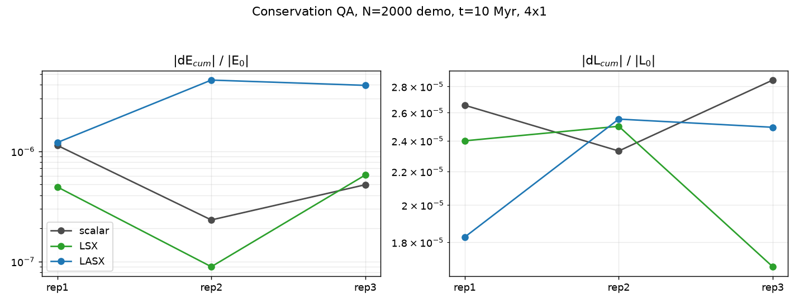

*图 8-1：t=10 Myr 三次重复的累积相对守恒误差（对数轴；灰=标量，绿=LSX，蓝=LASX）。*

| 构建 | dE_cum / \|E₀\|（3 次） | dL_cum / \|L₀\|（3 次） |
|---|---|---|
| 标量（F64） | 1.13e-6 / 2.39e-7 / 4.98e-7 | 2.65e-5 / 2.33e-5 / 2.85e-5 |
| LSX（F32） | 4.75e-7 / 8.98e-8 / 6.09e-7 | 2.40e-5 / 2.50e-5 / 1.68e-5 |
| LASX（F32） | 1.20e-6 / 4.42e-6 / 3.96e-6 | 1.83e-5 / 2.55e-5 / 2.49e-5 |
| tsv110 标量（参照） | 6.5e-7 / 1.9e-6 / 2.5e-6 | 1.7e-5 / 1.8e-5 / 1.5e-5 |
| tsv110 NEON（参照） | 3.3e-6 / 2.0e-6 / 4.4e-7 | 2.3e-5 / 3.7e-5 / 3.0e-5 |

能量守恒最多退化半个数量级（LASX 在 1e-6 量级），角动量误差基本不变（约 2e-5），且没有任何一次运行出现硬双星事件引起的 7% 级离散跳变。**对科学目标而言，F32 树力没有付出任何实质性代价。**

上述检查在软件链构建上完成。默认 hw 构建把 rsqrt 误差降为 0，在 t=2 Myr 的 4k/8k/16k 弱扩展上进一步改善了守恒性：末态能量误差在 N=16000 为 1.37e-7（软件链 2.13e-6，约小 15 倍），角动量累积误差在 N=4000/16000 分别小 12%/24%（详见 `REPORT_RSQRT_CN.md` §7.4）。

---

## 9. 生产运行（100 Myr）

生产样例沿用官方 sample 流程：mcluster 生成 N=1000、95% 原生双星（IMF 到 50 M☉），`petar.init` 转换文件，运行命令为 `OMP_NUM_THREADS=8 petar -u 1 -b 500 -t 100 -o 5 input`。

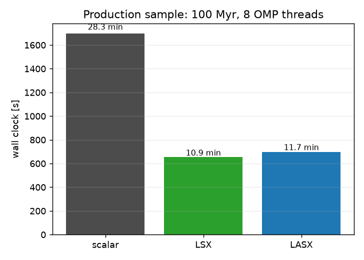

*图 9-1：100 Myr 生产样例墙钟（8 OMP 线程）。*

| 指标 | 标量 | LSX | LASX |
|---|---:|---:|---:|
| 墙钟 | 28 分 16 秒（1696 s） | **10 分 54 秒（654 s）** | **11 分 39 秒（699 s）** |
| 收尾 | `FDPS has successfully finished` | 正常 | 正常 |
| 输出文件 | 25 项 | 25 项，集合一致 | 25 项，集合一致 |
| 末态能量误差 | 3.59e-6 | 9.33e-5 | -4.57e-6 |
| 累积 dL / \|L₀\| | 0.91 | 0.90 | 0.29 |

两个 SIMD 构建都把 100 Myr 长跑从近半小时压到约 11 分钟（**2.4～2.6×**）。LSX 与 LASX 之间 7% 的差异、以及末态误差的抖动，都由随机硬双星事件主导（同一初值重复运行可差 1.6～3.3 倍），因此**排名请以第 5、6 节的固定步数短基准为准**；长跑只用于确认两个宽度都已具备生产可用性。

---

## 10. 跨平台定位

N=2000 demo 与测量规程与早先在 Kunpeng-920（tsv110，24 核）和双路 Xeon E5-2696 v3（36 核，AVX2）上的基准一致。那两组结果在这里作为外部参照列出；本报告的数据全部在 3A6000 上测得。

### 10.1 内核与端到端

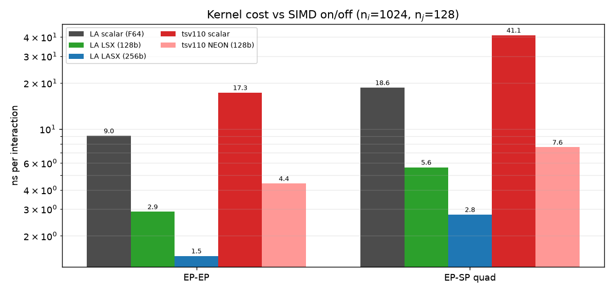

*图 10-1：各构建的内核每次交互成本（ni=1024，nj=128，对数轴）。*

| 构建 | EP-EP 内核 [ns] | 单核 1×1 [s] | 最优配置 [s] | 单核 SIMD 收益 |
|---|---:|---:|---|---:|
| 3A6000 标量（F64） | 9.03 | 38.86 | 12.06（4×1） | — |
| 3A6000 **LSX** | 2.88 | 18.70 | 6.04（1×4） | **2.08×** |
| 3A6000 **LASX** | 1.48 | 14.10 | **4.53（1×4）** | **2.76×** |
| tsv110 标量（24 核） | 17.3 | 70.76 | 7.19（24×1） | — |
| tsv110 **NEON** | 约 4.4 | 未测 | 未测 | 1.6～2.3×（端到端） |
| Xeon ×2 **AVX2** | 无同驱动数据 | 10.33 | 3.14（36×1 绑核） | — |

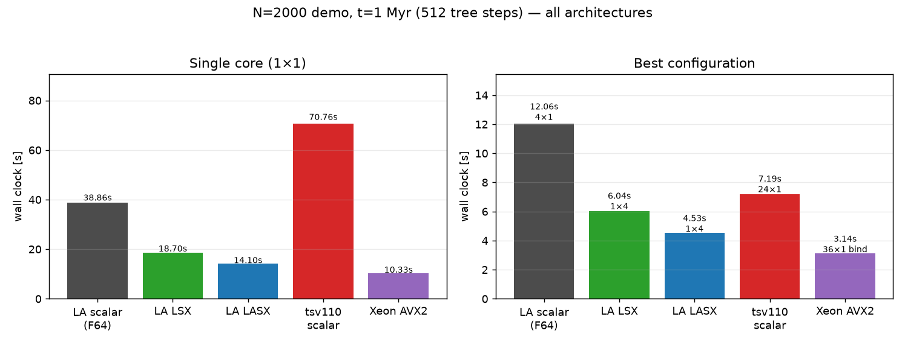

*图 10-2：左=单核墙钟；右=各平台最优配置。*

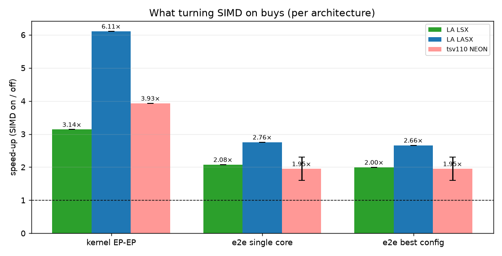

*图 10-3：打开 SIMD 在内核、单核与最优配置三个层面的收益。*

两点观察。第一，同为 128 位，LSX 比 tsv110 的 NEON 内核快 1.5 倍（2.88 ns 对约 4.4 ns），差距来自 LA664 核本身——更高的每周期吞吐与约两倍的单核 DRAM 带宽。第二，4 核 3A6000 用 LASX 在 N=2000 上跑出 4.53 s，快过 24 核 tsv110 的 7.19 s——只用了 4 个核。

### 10.2 口径提醒：s/Myr 只在树步数相同时可比

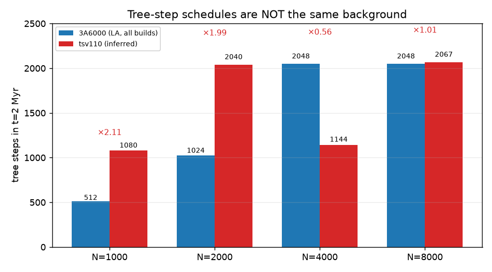

*图 10-4：t=2 Myr 内实际走的树步数（tsv110 由公开的 s/Myr 与 ms/步反推）。*

跨机 s/Myr 很容易被自动树步长误导：同样 t=2 Myr，3A6000 走 512/1024/2048/2048 步，而 tsv110 约走 1080/2040/1144/2067 步。N=2000 时 tsv110 多做了约一倍步数（s/Myr 被抬高），N=4000 时只做了约一半（s/Myr 被压低）。直接相除可让比值失真 2～4 倍。

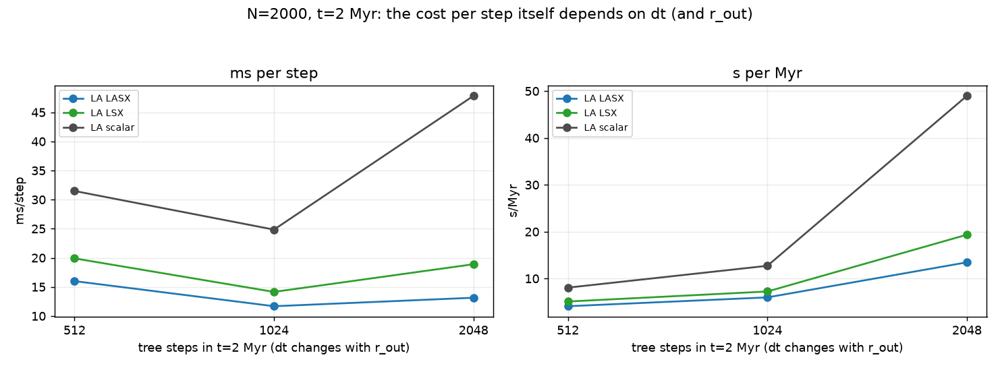

*图 10-5：N=2000 时每步成本本身随 dt（及 r_out）变化。*

对齐步数后，大部分异常随之消失：

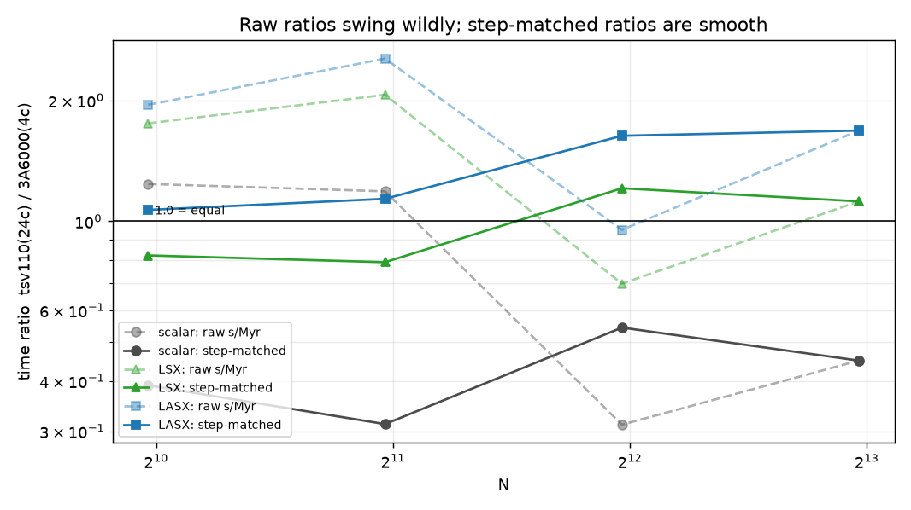

*图 10-6：tsv110（24 核）/ 3A6000（4 核）时间比；虚线=原始 s/Myr，实线=步数对齐。*

| N | tsv110 步数（反推） | 标量：原始 → 对齐 | LSX：原始 → 对齐 | LASX：原始 → 对齐 |
|---:|---:|---:|---:|---:|
| 1000 | ≈1080 | 1.24 → **0.39** | 1.75 → **0.82** | 1.95 → **1.07** |
| 2000 | ≈2040 | 1.19 → **0.31** | 2.07 → **0.79** | 2.54 → **1.14** |
| 4000 | ≈1144 | 0.31 → **0.54** | 0.70 → **1.21** | 0.95 → **1.63** |
| 8000 | ≈2067 | 0.45 → **0.45** | 1.12 → **1.12** | 1.68 → **1.68** |

*（>1 表示 4 核 3A6000 更快。）*

对齐后结论一致：标量构建全程落后 24 核 tsv110 约 2～3 倍；LSX 在 N≈3000 附近越过平线，大 N 反超；LASX 全程领先，优势从 1.07× 平滑增长到 1.68×。原始比值里的大幅摆动纯属步数口径造成的假象。给未来跨机测试的建议：固定时间步（或至少同时报告步数与 r_out），或只比较 ms/步。

### 10.3 为什么 4 核能和 24 核有来有回

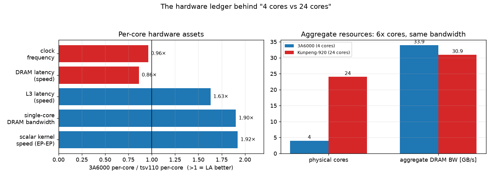

*图 10-7：左=每核资产；右=聚合资源。*

| 每核项目 | 3A6000 | tsv110 | 比值 |
|---|---:|---:|---:|
| 标量 EP-EP 内核（nj=128） | 9.0 ns | 17.3 ns | **1.92×** |
| 单核 DRAM triad 带宽 | 23.4 GB/s | 12.3 GB/s | **1.90×** |
| L3 延迟 | 17.3 ns | 28.2 ns | **1.63×** |
| DRAM 延迟 | 95.1 ns | 82.0 ns | 0.86× |
| 主频 | 2.5 GHz（固定） | 2.6 GHz | 0.96× |

LA664 的单核标量吞吐与单核内存带宽都约为 tsv110 的两倍，L3 延迟更低；仅 DRAM 延迟（差 14%）与主频（低 4%）略吃亏。树力吃带宽与 L3，短程力/集群搜索吃延迟——两类负载 3A6000 都不落下风。

聚合带宽是关键平衡项：4 个 LA664 核可持续 **33.9 GB/s**，略高于 24 个 tsv110 核的 30.9 GB/s。带宽墙等高之后，比较就变成"每字节带宽能完成多少交互"——这正是 SIMD 的用武之地。N=2000→8000 的每步增长也印证了这一点：

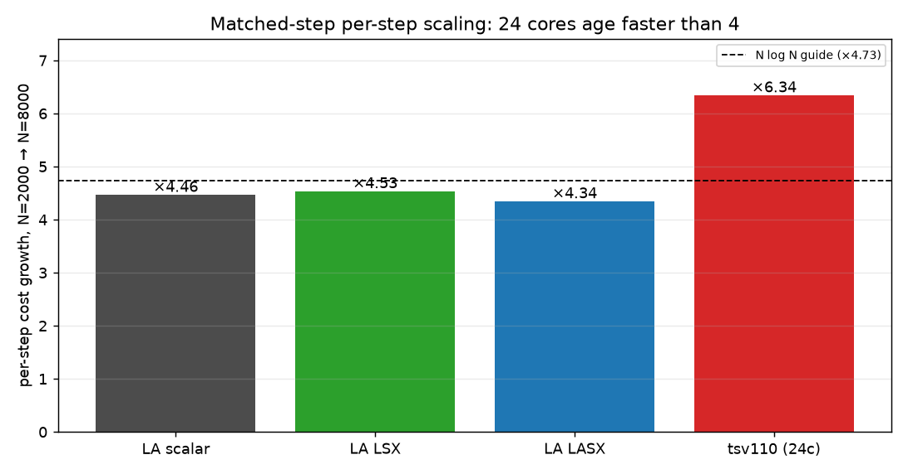

*图 10-8：步数对齐下每步成本的增长（理论 N log N = 4.73×）。*

| 构建（步数对齐） | 每步增长 N=2000 → 8000 | 相对 N log N |
|---|---:|---:|
| tsv110（24 核） | **6.34×** | +34% |
| 3A6000 标量（4 核） | 4.46× | -6% |
| 3A6000 LSX | 4.53× | -4% |
| 3A6000 LASX | **4.34×** | -8% |

24 核机器的每步成本增长超过理论 N log N，因为域数越多，LET 交换与负载不均越重；4 域分解的增长则平缓得多。这就是 N 越大、LA664 构建相对位置越好的原因。

**平衡的结论**：中小 N、多作业并发时，4 核 3A6000 + SIMD 的每核产出最高，单作业可追平甚至超过 24 核机器；大 N、持续高吞吐仍需多核机器——它在这个档位缺的是效率，不是资源。

### 10.4 尚存的空白

tsv110 与 Xeon 机器无法做同粒度的每步剖析，因此"剩下 56% 的时间"这一论证建立在"短程力与集群搜索在两边都未向量化"的定性事实之上，无法逐项数值对比。tsv110 的步数由公开的两个汇总量反推，且 N=4000 的步数对齐点仍存约 11% 的差异（1024 对约 1144 步）。要补上这些空白，需要在那些机器上用同一剖析构建重跑。

---

## 11. 经验与后续方向

1. **F32 + 精确反比开方的配方可以干净移植**。最大力误差保持 1e-4 量级（阈值 7e-3），邻居计数逐位一致，守恒保持 1e-6 量级——提速不以物理精度为代价。默认采用平台精确指令（rsqrt 误差 0），在性能与软件链等价的前提下进一步改善力误差与守恒性；软件链作为可选项保留。
2. **Amdahl 现在是主导因素**。移植后树力只占单核单步的约 40%，短程 Hermite 力（F64）与集群搜索占了大头；下一步的杠杆在那里，继续加宽树力向量收益有限。
3. **最优并行布局从 4×1 变为 1×4**；超订与 SMT 在该平台上均无收益。
4. **报告 s/Myr 时务必附上树步数**。第 10 节的跨平台对比证明步数失配可让比值失真 2～4 倍；ms/步或固定 dt 才是安全口径。
5. **能用 LASX 就用 LASX**。它是真正的 256 位通路（内核速度是 LSX 的 2 倍）且不损失精度；只有 LSX 的 LA64 CPU 用 LSX 依然是正确选择，端到端仍有约 2 倍收益。

---

## 12. 结论

LoongArch LSX/LASX 树力移植功能完整、可用于生产。内核级 3.2×（LSX）与 6.3×（LASX）的提速，转化为每核端到端 2.1～2.8 倍、100 Myr 生产运行 2.4～2.6 倍的收益，数值守恒性与标量构建在对 N 体科学有意义的精度上没有区别；默认的反比开方采用平台精确指令（误差 0），在生产性能与软件链等价的同时进一步改善守恒性（`REPORT_RSQRT_CN.md`）。在这台 4 核平台上，LASX 跑 N=2000 标准 demo 比 24 核 Kunpeng-920 更快——不是因为核数不再重要，而是因为 SIMD 放大了该负载真正消耗的每核资产。

---

## 附录 A：构建与测试命令

```bash
# configure（需要 FDPS 与 SDAR 源码树）
./configure --with-arch=loongarch --with-simd=lasx --with-mpi=yes \
    --prefix=$PWD/install \
    --with-fdps-prefix=/path/to/FDPS --with-sdar-prefix=/path/to/SDAR
make -j8 && make install

# 可选：软件修正链（默认 hw 为平台精确指令 xvfrsqrt.s / vfrsqrt.s）
make LARCH_SIMD=lasx LARCH_RSQRT=sw

# 构建并运行官方自检
make build/petar.simd.test && ./build/petar.simd.test

# 改用 LSX
./configure --with-arch=loongarch --with-simd=lsx --with-mpi=yes
make -j8

# 标量构建
./configure --with-arch=loongarch --with-simd=no --with-mpi=yes
make -j8
```

运行提示：大规模运行建议设置 `OMP_STACKSIZE=128M` 与 `ulimit -s unlimited`；MPI 与 OpenMP 混用时建议给 OpenMPI 加 `--bind-to none`；在 4 核 8 线程 CPU 上开 8 个 rank 需要 `--use-hwthread-cpus`。

## 附录 B：图清单

| 图 | 内容 |
|---|---|
| `figs/figK1_kernel_ni1024.png` | 内核每交互成本（ni=1024） |
| `figs/figK2_kernel_bars.png` | 内核成本柱状对比（ni=1024、nj=2048） |
| `figs/figS1_scan_wall.png` | 配置扫描墙钟 |
| `figs/figS2_scan_speedup.png` | 并行加速比 |
| `figs/figB1_perstep_breakdown.png` | 每步耗时堆叠分解 |
| `figs/figP1_probe.png` | 启动开销探针 |
| `figs/figN1_weak_scaling.png` | 弱扩展 |
| `figs/figN2_strong_scaling.png` | 强扩展 |
| `figs/figC1_conservation.png` | 守恒 QA |
| `figs/figPR1_productivity.png` | 100 Myr 生产墙钟 |
| `figs_cross/figX1_kernel_all.png` | 跨平台内核成本 |
| `figs_cross/figX2_single_best_all.png` | 跨平台单核/最优配置 |
| `figs_cross/figX3_simd_speedup.png` | 跨平台 SIMD 收益 |
| `figs_cross/figX4_scan_all.png` | 跨平台配置扫描 |
| `figs_cross/figX5_weak_all.png` | 跨平台弱扩展 |
| `figs_cross/figX6_perstep_all.png` | 跨平台每步成本 |
| `figs_cross/figW1_steps_schedule.png` | 树步数表 |
| `figs_cross/figW2_matched_curves.png` | 原始与步数对齐曲线 |
| `figs_cross/figW3_ratio_raw_vs_matched.png` | 原始与对齐比值 |
| `figs_cross/figW4_dt_sensitivity.png` | N=2000 dt 敏感性 |
| `figs_cross/figW5_hw_ledger.png` | 每核与聚合硬件账本 |
| `figs_cross/figW6_scaling_matched.png` | 步数对齐的每步增长 |
| `figs_rsqrt/figR1..figR7_*.png` | 反比开方 A/B 专项图（见 `REPORT_RSQRT_CN.md`） |
| `figs_cross/figW6_scaling_matched.png` | 步数对齐的每步增长 |
