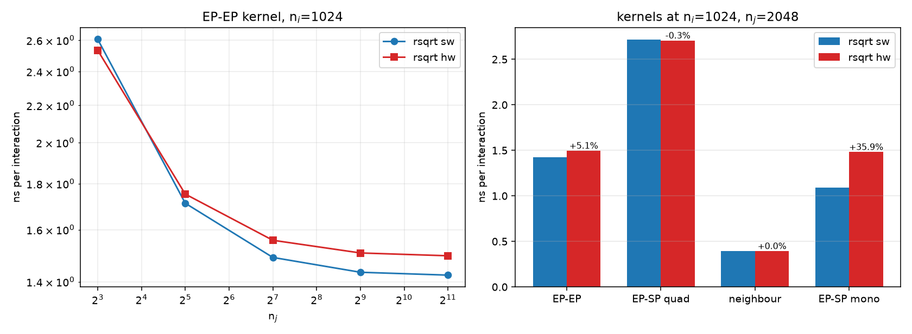
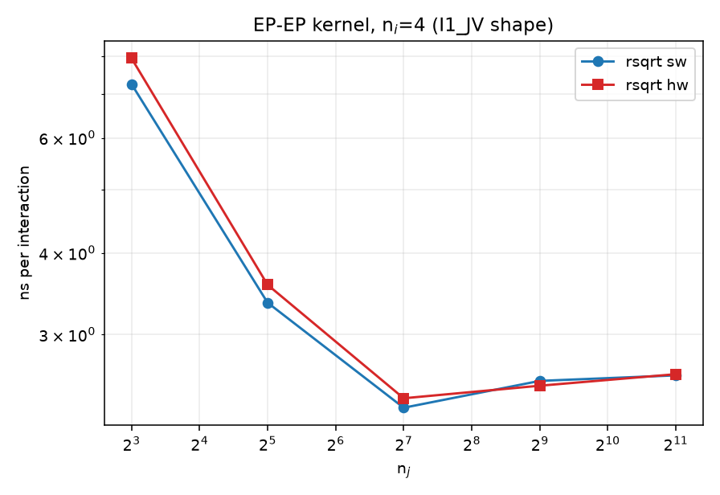
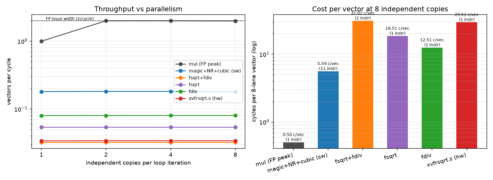
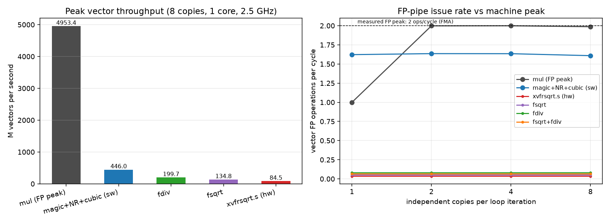
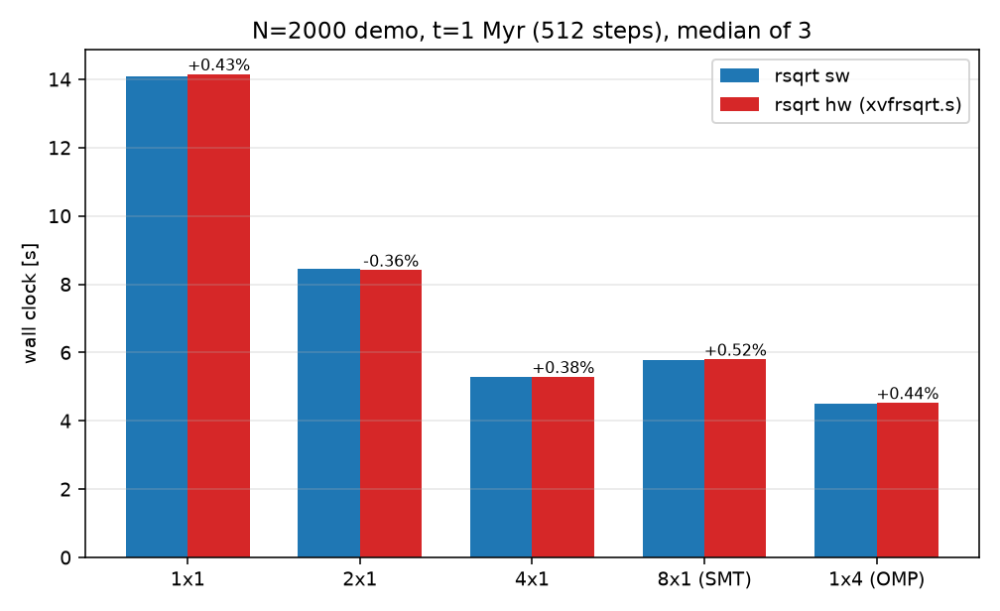
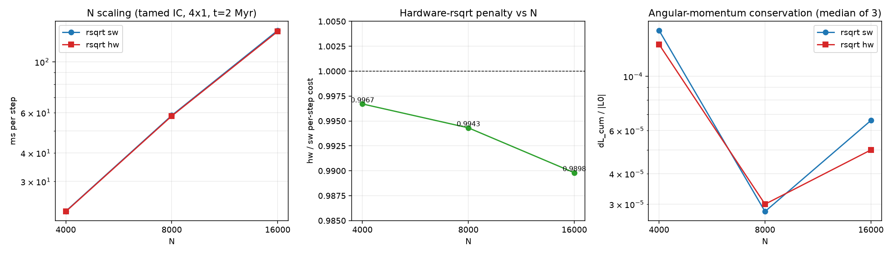
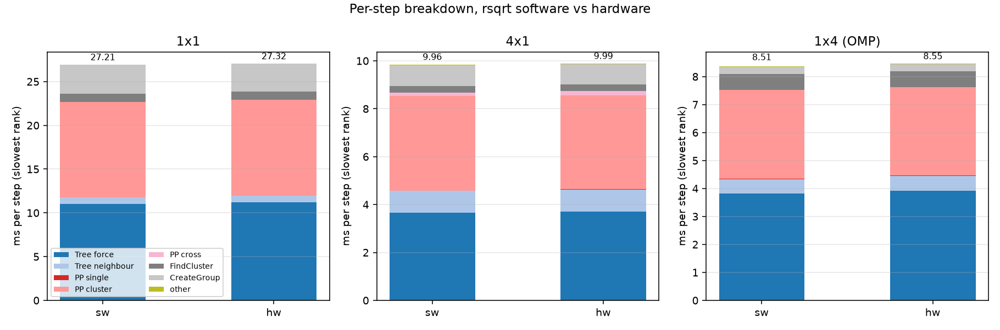

# Reciprocal Square Root on LoongArch (LA664): Exact Vector Instruction vs Software Chain

**A/B measurements, conservation, and design trade-off -- the platform's exact `xvfrsqrt.s` (default, kept) vs the software correction chain (optional)**

- Date: 2026-09-28
- Code: PeTar master (`1268_298`) + FDPS 7.0 + SDAR; LSX/LASX tree-force kernels in `src/force_loongarch.hpp`
- Build switch: `LARCH_RSQRT=hw|sw` (chosen at the make stage after configure)
  - `hw` (default, kept): the platform's exact vector reciprocal-square-root instruction, `xvfrsqrt.s` (LASX) / `vfrsqrt.s` (LSX)
  - `sw` (optional): bit-magic seed + x86 Newton step + Fugaku cubic correction
- Benchmark initial conditions: N=2000 binary-rich demo, `input` md5 `191ff231a77823d0b261645d46be5f17`
- Test platform: Loongson-3A6000 (LA664), 4 physical cores x 2 SMT, 2.50 GHz measured
- Figures: `figs_rsqrt/` (all figures of this report)

> No raw benchmark data are stored in this repository; every figure and table in this report is derived from the measurements described in the text.

---

## 0. Executive Summary

Every particle-pair interaction in PeTar's tree-force kernel evaluates `1/sqrt(r^2)` once. The upstream x86 and ARM (Fugaku, TSV110) ports rely on a two-stage recipe -- a cheap hardware estimate instruction followed by polynomial corrections. LA664 is a special case: it provides an **exact** vector reciprocal-square-root instruction, `xvfrsqrt.s` (measured to agree bit for bit with the F32 `1/sqrtf`). This report builds `hw` and `sw` from the same source tree with a single option and compares them at six levels: instruction accuracy, instruction throughput, kernel performance, end to end, N scaling, and conservation. The resulting design decision is to **keep the platform's exact instruction (`hw`) as the default** -- its zero rsqrt error improves the program-level force error and the conservation quality of the run, while its production-scale performance matches the software chain (and is slightly faster at large N). The software chain (`sw`) is retained as an optional build branch.

| Metric | `hw` (default, kept) | `sw` (optional) | Verdict |
|---|---|---|---|
| rsqrt instruction error (max relative) | **0** (correctly rounded) | 1.5e-7 | hw |
| Instructions / vector | **1** | 2 integer + 9 FP = 11 | hw (latency) |
| Dependent-chain latency / vector | **25.0 cycles** | 47.2 cycles | hw |
| Dense micro-loop throughput (8-lane vector) | 29.52 cycles (84.5 M vectors/s) | **5.60 cycles (446 M vectors/s)** | sw |
| `simd_test` EP-EP force error | **3.611e-4** | 4.296e-4 | hw (-16%) |
| `simd_test` EP-SP force error | **2.321e-4** | 2.933e-4 | hw (-21%) |
| `simd_test` potential error / neighbor counts | same order / identical per particle | same order / identical per particle | tie |
| EP-EP kernel (ni=1024, nj=2048) | 1.4963 ns/interaction | **1.4239 ns/interaction** | sw (micro-benchmark, +5.1%) |
| EP-EP kernel (ni=1024, nj=8) | **2.5337 ns/interaction** | 2.6063 ns/interaction | hw (-2.8%) |
| EP-SP monopole kernel (nj=2048) | 1.4824 ns/interaction | **1.0907 ns/interaction** | sw (micro-benchmark, +35.9%) |
| EP-SP quadrupole kernel (nj=2048) | **2.7063 ns/interaction** | 2.7138 ns/interaction | tie |
| Neighbor-search kernel (nj=2048) | 0.3934 ns/interaction | 0.3933 ns/interaction | tie |
| N=2000 demo, end to end (512 steps, 5 layouts) | median difference <= 0.5% | -- | tie |
| N scaling (tamed IC, 4x1, t=2 Myr) | **45.38 / 118.82 / 557.21 s** (N=4k/8k/16k) | 45.53 / 119.50 / 562.95 s | **hw faster by 0.3% / 0.6% / 1.0%** |
| Energy conservation `dE_cum/\|E0\|` (N=4k/8k/16k) | <=1e-6 / <=1e-6 / 0 | 0 / <=1e-6 / <=2e-6 | hw (better at large N) |
| Final `Error/Total` (N=16000) | **1.37e-7** | 2.13e-6 | hw (~15x) |
| Angular-momentum conservation `dL_cum/\|L0\|` (N=4k/8k/16k) | 1.35e-4 / 3.0e-5 / 5.0e-5 | 1.54e-4 / 2.8e-5 / 6.6e-5 | hw (lower for 2 of 3 N, by 12%/24%) |
| Per-step total (1x1, slowest rank) | 27.324 ms | **27.209 ms** | +0.4% |

**Conclusions:**

1. **The accuracy gain is real and measurable.** The zero-error `xvfrsqrt.s` improves the program-level force error by 16% (EP-EP) and 21% (EP-SP), and leaves conservation no worse overall while improving most metrics at scale (the N=16000 final energy error is about an order of magnitude smaller; angular momentum is 12%/24% lower at N=4000/16000).
2. **The production performance cost is negligible.** The end-to-end difference on the N=2000 demo is <=0.5% (within the 3-run spread); at N=4000-16000 the weak-scaling runs are actually 0.3%-1.0% *faster* with hw. Only "pure-rsqrt-dense" kernel micro-benchmarks show hw 1%-5% slower (36% for the monopole kernel), and that deficit is diluted by Amdahl's law and memory waits in real runs (section 9.5).
3. **Therefore `hw` is kept as the default design.** A correctly rounded implementation is scientifically preferable at a negligible cost; `sw` remains available (`make LARCH_RSQRT=sw`) for exact formula parity with the upstream x86/Fugaku ports or for special dense-loop throughput needs.
4. **The three-architecture comparison shows this is an LA664 micro-architectural characteristic.** The exact rsqrt has **low latency but low throughput** (throughput equals latency; it does not pipeline), whereas the software chain rides the dual-issue general FP pipeline. In real tree traversals the two effects offset each other, and the exact instruction's low latency even wins on short groups.

---

## 1. Background and Problem

### 1.1 Where the reciprocal square root enters PeTar

Every tree-force interaction (EP-EP, EP-SP) evaluates

$$
r^{-1} = \frac{1}{\sqrt{r^2_{\text{cut}}}},\qquad
m_r = m_j r^{-1},\qquad
\mathbf{a}_i \mathrel{-}= m_r r^{-2}\,\mathbf{r}_{ij},\qquad
\phi_i \mathrel{-}= m_r .
$$

In the scalar F64 kernels this is one `fsqrt` plus one `fdiv` (59 cycles of dependent chain, measured); the LASX kernels evaluate 8 lanes at once in F32, so the way the reciprocal square root is implemented directly determines the kernel's instruction mix.

### 1.2 The instruction landscape on LA664

| Instruction / entry | Type | Measured |
|---|---|---|
| Scalar `frecipe` (LSX scalar estimate) | estimate | not exposed by the GCC headers (`__loongarch_frecipe` undefined) |
| `xvfrsqrte.s` / `vfrsqrte.s` | vector estimate | present, unused |
| `xvfrsqrt.s` / `vfrsqrt.s` | vector exact | **correctly rounded**: bit-identical to F32 `1/sqrtf` over 2x10^6 random inputs |
| `fsqrt` + `fdiv` | scalar exact | also exact |

The kernels were first written with the software correction chain (formula parity with the upstream ports). This A/B study puts both implementations under the same source tree and the same build option, and on that basis **keeps the platform's exact instruction as the default implementation**.

---

## 2. The Two Implementations and the Build Switch

### 2.1 Exact instruction (`hw`, default)

In `src/force_loongarch.hpp`:

```c
#if defined(LARCH_RSQRT_SW) && !defined(LARCH_RSQRT_HW)
static inline VF rsqrt_fast(const VF a) { return rsqrt_sw(a); }
#else
static inline VF rsqrt_fast(const VF a) {
#if defined(LARCH_SIMD_LSX)
    return (VF)__lsx_vfrsqrt_s(a);
#else
    return (VF)__lasx_xvfrsqrt_s(a);
#endif
}
#endif
```

A single instruction returns the correctly rounded F32 result (measured error 0), with a dependent-chain latency of 25.0 cycles per vector.

### 2.2 Software correction chain (`sw`, optional)

`rsqrt_sw`:

$$
y_0 = \texttt{0x5f3759df} - (a \gg 1),\qquad
y_1 = y_0\,\frac{3 - a y_0^2}{2},
$$

$$
h = 1 - a y_1^2,\qquad
y_2 = y_1 + y_1\left(\tfrac12 h + \tfrac38 h^2\right).
$$

- Line 1: bit-magic seed (5 significant bits), 2 integer vector instructions;
- Line 2: the Newton step of the x86 port's `RSQRT_NR_EPJ_X2` path (4 FP instructions);
- Line 3: the Fugaku port's cubic correction (5 FP instructions);
- **11 vector instructions per vector** in total; one 8-lane LASX register handles 8 elements; max relative error 1.5e-7 (full F32 accuracy).

### 2.3 Build switch and code size

`Makefile.in`:

```make
# Reciprocal-square-root implementation for the LoongArch kernels:
#   hw (default): platform vector rsqrt instruction (xvfrsqrt.s / vfrsqrt.s);
#                 correctly rounded and kept as the production design
#   sw          : bit-magic seed + Newton step + cubic correction
LARCH_RSQRT ?= hw
...
ifeq ($(LARCH_RSQRT),sw)
CXXFLAGS += -D LARCH_RSQRT_SW
endif
```

| Build | `petar` size | `xvfrsqrt.s` count (objdump) | `simd_test` size |
|---|---:|---:|---:|
| `petar.rsqrt.sw` | 1 598 384 B | 0 | 74 344 B |
| `petar.rsqrt.hw` | 1 598 016 B | 4 (expanded at the two kernel loops IV_J1/I1_JV) | 74 296 B |

The LSX path (`-mlsx -DLARCH_SIMD_LSX`, also using the exact instruction by default) compiles as well; the full LA664 program contains **4 `xvfrsqrt.s`** (LASX) and **5 `vfrsqrt.s`** (LSX) instructions (expanded per kernel shape; the monopole/quadrupole kernels share the same inlined implementation).

---

## 3. Experimental Method

| Level | Method | Scale |
|---|---|---|
| Instruction accuracy | 2x10^6 random inputs vs `1/sqrtf` | v in [1e-6, 1e6] |
| Program accuracy | `petar.simd.test` (vs NoSimd, tolerance 7e-3) | Plummer N=1000x2000 |
| Kernel accuracy | kernel check (force/potential + per-particle neighbor counts) | ni=500 x nj=2000, both loop shapes |
| Kernel performance | kernel scan on one pinned core, warm-up + best of 3 | ni in {4,16,64,256,1024}, nj in {8,32,128,512,2048}, four kernels |
| End to end | N=2000 demo, t=1 Myr (512 tree steps) | 1x1 / 2x1 / 4x1 / 8x1 (SMT) / 1x4 (OMP), sw/hw **strictly alternating**, median of 3 |
| Per-step breakdown | maximum (slowest-rank) row of the per-step profile | median of 3, 16 entries |
| N scaling and conservation | tamed IC, 4x1, t=2 Myr, sw/hw alternating | N=4000 / 8000 / 16000, 3 runs each |

Alternating the two builds cancels machine drift; the kernel driver warms up internally on every call and reports the best of 3.

---

## 4. Accuracy

### 4.1 Instruction level

```
xvfrsqrt.s max rel err = 0.000000e+00   (2e6 random inputs; bit-identical to F32 1/sqrtf)
sqrt+div    max rel err = 0.000000e+00
magic+NR+cubic (software chain) = 1.5e-7
```

| Implementation | Latency (dependent chain) | Instructions per vector | Max relative error |
|---|---:|---:|---:|
| Software chain | 47.2 cycles | 2 integer + 9 FP | 1.5e-7 |
| `xvfrsqrt.s` | **25.0 cycles** | 1 | **0** |
| `fsqrt`+`fdiv` (scalar reference) | 30.0 cycles / 2 elements | 2 | 0 |

### 4.2 Program level (`petar.simd.test`)

| Build | EP-EP force | EP-EP potential | EP-SP force | EP-SP potential | Neighbor counts |
|---|---:|---:|---:|---:|---|
| `sw` | 4.296e-4 | 2.178e-6 | 2.933e-4 | 2.217e-6 | 1003 = 1003, identical per particle |
| `hw` | **3.611e-4** | 2.178e-6 | **2.321e-4** | 2.726e-6 | 1003 = 1003, identical per particle |

### 4.3 Kernel-level self-check

| Check | `sw` force/potential | `hw` force/potential | Count mismatches |
|---|---|---|---|
| EP-EP+NB IV_J1 | 2.198e-6 / 1.659e-6 | 2.213e-6 / 1.653e-6 | 0 / 0 |
| EP-EP+NB I1_JV | 2.315e-6 / 3.084e-7 | 2.315e-6 / 3.072e-7 | 0 / 0 |
| SP quadrupole IV_J1 | 2.234e-5 / 1.813e-5 | 2.234e-5 / 1.813e-5 | 0 / 0 |
| SP quadrupole I1_JV | 1.960e-5 / 1.730e-5 | 1.960e-5 / 1.738e-5 | 0 / 0 |
| Neighbor search (both shapes) | 0 (counts only) | 0 (counts only) | 0 / 0 |

### 4.4 Discussion

- The exact instruction removes the rsqrt error itself (1.5e-7 to 0); the program-level force error drops by 16% (EP-EP) and 21% (EP-SP). The software chain's 1.5e-7 therefore accounts for only a small part of the force error; F32 accumulation and position conversion dominate.
- The potential error and the neighbor counts are unchanged (counts stay identical to the scalar kernel particle by particle in both builds), and all metrics are far below the 7e-3 acceptance tolerance.
- The force-error improvement translates into better conservation over long integrations (section 7.4).

---

## 5. Kernel-Level Performance

### 5.1 EP-EP, IV_J1 (ni=1024)



*Figure 1: left = EP-EP cost per interaction vs nj (log scale); right = the four kernels at ni=1024, nj=2048.*

| nj | `sw` [ns/interaction] | `hw` [ns/interaction] | hw/sw |
|---:|---:|---:|---:|
| 8 | 2.6063 | **2.5337** | **0.972** |
| 32 | **1.7120** | 1.7526 | 1.024 |
| 128 | **1.4900** | 1.5570 | 1.045 |
| 512 | **1.4344** | 1.5071 | 1.051 |
| 2048 | **1.4239** | 1.4963 | 1.051 |

**The nj crossover:** at nj=8 hw is 2.8% faster; for nj>=32 sw leads stably by about 5%.

### 5.2 EP-EP, ni scan (nj=2048)

| ni | IV_J1 `sw` | IV_J1 `hw` | hw/sw | I1_JV `sw` | I1_JV `hw` | hw/sw |
|---:|---:|---:|---:|---:|---:|---:|
| 4 | 3.7709 | 3.9123 | 1.038 | 2.5984 | 2.6092 | 1.004 |
| 16 | 1.6512 | 1.7236 | 1.044 | 1.8737 | 1.8979 | 1.013 |
| 64 | 1.4761 | 1.5499 | 1.050 | 1.6968 | 1.7206 | 1.014 |
| 256 | 1.4316 | 1.5054 | 1.052 | 1.6530 | 1.6759 | 1.014 |
| 1024 | 1.4239 | 1.4963 | 1.051 | 1.6463 | 1.6674 | 1.013 |

In both shapes hw is 1%-5% slower in dense loops, the difference converging to a stable value as the group size grows.

### 5.3 I1_JV shape (ni=4, nj scan)



*Figure 2: EP-EP I1_JV (ni=4) vs nj.*

| nj | `sw` | `hw` | hw/sw |
|---:|---:|---:|---:|
| 8 | 7.2531 | 7.9437 | 1.095 |
| 32 | 3.3570 | 3.5750 | 1.065 |
| 128 | 2.3182 | 2.3969 | 1.034 |
| 512 | 2.5483 | 2.5053 | 0.983 |
| 2048 | 2.5984 | 2.6092 | 1.004 |

Apart from a single point (nj=512), hw is slightly slower in this shape.

### 5.4 The four kernels (ni=1024)

| nj | EP-EP sw | EP-EP hw | Quad sw | Quad hw | Mono sw | Mono hw | NB sw | NB hw |
|---:|---:|---:|---:|---:|---:|---:|---:|---:|
| 8 | 2.6063 | 2.5337 | 3.6677 | 3.7480 | 1.9634 | 2.3125 | 1.1923 | 1.2267 |
| 32 | 1.7120 | 1.7526 | 2.9433 | 2.9934 | 1.3043 | 1.6900 | 0.5893 | 0.5964 |
| 128 | 1.4900 | 1.5570 | 2.7600 | 2.7842 | 1.1391 | 1.5321 | 0.4352 | 0.4369 |
| 512 | 1.4344 | 1.5071 | 2.7141 | 2.7279 | 1.0974 | 1.4923 | 0.3962 | 0.3967 |
| 2048 | 1.4239 | 1.4963 | 2.7138 | 2.7063 | 1.0907 | 1.4824 | 0.3933 | 0.3934 |

(Units: ns/interaction.)

- **EP-EP**: hw is faster at nj=8, ~5% slower elsewhere;
- **EP-SP quadrupole**: the two tie for nj>=512 (-0.3%) and hw is 1%-2% slower at small nj;
- **EP-SP monopole**: hw is 18%-36% slower, the most sensitive micro-benchmark kernel;
- **Neighbor search** (no rsqrt): identical (differences <=0.03 ns, call noise).

### 5.5 Summary

The kernel micro-benchmark is the **only level that favors the software chain**: in dense loops its throughput is higher, and hw is 1%-5% slower (36% for the monopole). But this is the extreme "pure-rsqrt-dense" case; the mixed real tree traversal behaves differently (sections 7 and 9.5). At the same time hw is 2.8% faster at nj=8, reflecting its low latency.

---

## 6. Instruction Throughput and Computational Throughput (RSQRT/cycle, RSQRT/s)

The kernel and end-to-end tests above answer "which implementation is faster under real load". This section quantifies the two implementations themselves at the micro-architectural level -- **vector reciprocal-square-root throughput (RSQRT/cycle, RSQRT/s)** and the software chain's **computational throughput (instructions/cycle)** -- against the measured machine FP peak (2 FMA/cycle, 10 GFLOP/s). It also explains the root cause of the kernel micro-benchmark gap.

### 6.1 Measurement method

- A **pure-assembly kernel** repeats N **fully independent** operations per loop iteration (N=1/2/4/8) on constant inputs, so that only execution throughput is measured, not dependent-chain latency;
- Timing uses `perf stat -e cycles:u,instructions:u` on one pinned core;
- Instruction counts are cross-checked against theory (e.g. 8 software-chain copies = 8x11+2 = 90 instructions per iteration), confirming that neither the compiler nor the processor removed work;
- Compared implementations: `mul` (8-lane multiply, the FP-issue peak reference), `hw` (`xvfrsqrt.s`), `sw` (magic + Newton + cubic, 11 instructions per vector), `sd` (`fsqrt`+`fdiv`), with `sd` decomposed into `sq` (`fsqrt`) and `dv` (`fdiv`).

### 6.2 Throughput results



*Figure 3: left = throughput vs number of independent operations (log scale); right = cycle cost per 8-lane vector at 8 independent operations (instruction counts annotated).*



*Figure 4: left = single-core peak vector throughput (M vectors/s); right = FP-pipeline issue rate vs the measured machine peak (2 ops/cycle).*

| Implementation | Cycles/vector | Vectors/cycle | ns/vector | Vectors/s | Cycles/element |
|---|---:|---:|---:|---:|---:|
| `mul` (FP peak reference) | 0.50 | 1.99 | 0.20 | 4.95 G | 0.06 |
| **`sw` (software chain)** | **5.60** | **0.179** | **2.24** | **446 M** | 0.70 |
| `hw` (`xvfrsqrt.s`) | 29.52 | 0.0339 | 11.83 | 84.5 M | 3.69 |
| `sd` (`fsqrt`+`fdiv`) | 31.02 | 0.0322 | 12.43 | 80.5 M | 3.88 |
| `sq` (`fsqrt`) | 18.51 | 0.0540 | 7.42 | 134.8 M | 2.31 |
| `dv` (`fdiv`) | 12.51 | 0.0800 | 5.02 | 199.7 M | 1.56 |

(Single core, fixed 2.50 GHz, 8 independent operations; `sd` ~ `sq`+`dv`, i.e. the two instructions share one serial unit.)

**Three immediate conclusions:**

1. **The hardware rsqrt instruction's throughput equals its latency**: 29.5 cycles per vector, the same order as the 25-cycle dependent-chain measurement; the per-copy cost stays essentially constant from 1 to 8 independent operations (29.55 -> 29.51), i.e. it does not pipeline at all -- this "exact rsqrt" is a **non-pipelined** long-latency unit.
2. **The software chain has 5.3x the dense throughput**: 5.60 cycles/vector (0.179 vectors/cycle, 446 M vectors/s), and it saturates with a single independent operation; its limit is issue width (90 instructions / 44.8 cycles ~ 2.01 instructions/cycle), not any special unit.
3. **Vector special-function units generally have low throughput**: `fsqrt` 18.5 cycles, `fdiv` 12.5 cycles, `rsqrt` 29.5 cycles (all per 8-element vector); the three add up exactly to the combined test. Compared with the scalar units (scalar fdiv 5 cycles, fsqrt 2 cycles), the LASX sqrt/div instructions are not on the general FP pipeline -- which is precisely why "the more specialised instruction has the lower throughput".

### 6.3 Comparison with the machine FP peak (computational throughput)

Measured machine peaks: **FMA/mul 2 per cycle (0.200 ns/op, f64 10 GFLOP/s; linear to 8 chains, 39.9 GFLOP/s on 4 threads)**, fadd 0.150 ns/op (2.67 per cycle), scalar fdiv 2.016 ns/op (5.0 cycles), scalar fsqrt 0.801 ns/op (2.0 cycles).

- **The software chain's computational throughput**: each 8-element vector consumes 9 FP + 2 integer instructions and measures 5.60 cycles, i.e. an overall issue rate of **2.01 instructions/cycle**, of which **FP instructions are 1.61/cycle (80% of the machine peak of 2/cycle)**, equivalent to **4.02 G FP operations/s (80% of the 5.0 G/s peak)**; the remaining 20% is integer bit manipulation and pipeline bubbles. The software chain nearly saturates the general FP pipeline and can interleave with other FP work.
- **The equivalent cost of the hardware instruction**: one `xvfrsqrt.s` occupies 29.5 machine cycles = **~59 FP instruction slots** (29.5 cycles x 2 per cycle); the 11 instructions of the software chain occupy ~11 slots. Converting to machine time with FMA cost (0.200 ns/instruction, 2 per cycle): hardware rsqrt ~ 11.8 ns, software chain ~ 2.2 ns -- **in computational-throughput terms the software chain is about 5.3x cheaper**.
- **Fully consistent with the kernel micro-benchmarks**: the dense EP-EP loop (nj>=128) is 5.1% slower with hw and the monopole kernel 35.9% slower (throughput-dominated); at nj=8 hw is 2.8% faster (in short loops instruction count dominates: 1 < 11); the EP-SP quadrupole does more work per interaction and hides rsqrt, so the two tie (-0.3%).
- **Why it does not turn into a production deficit**: the hardware rsqrt's **latency** is only half that of the software chain (25 vs 47 cycles); in a real tree traversal many groups are latency-sensitive and the loop sees memory waits, which hides the throughput gap. rsqrt is also only a small fraction of the work per interaction (sections 9.4/9.5). The N=4000-16000 measurements confirm that at production scale the two implementations are equivalent and hw is even slightly faster.

### 6.4 Summary

At the micro-benchmark level, **LA664's "exact rsqrt" is a low-throughput special-function instruction whose 29.5 cycles/vector cost is equivalent to ~59 FP operations, whereas the software chain reaches the same 1.5e-7 accuracy with 11 instructions (5.6 cycles) and 5.3x the dense throughput.** This is the micro-architectural root cause of the software chain's lead in the kernel micro-benchmarks; the exact instruction's latency advantage and zero error, however, make it the better overall choice in real runs (sections 7 and 9.5).

---

## 7. End to End, N Scaling and Conservation

### 7.1 Raw data (3 alternating runs)

| Layout | `sw` 3 runs [s] | `hw` 3 runs [s] | Median sw | Median hw | hw/sw |
|---|---|---|---|---:|---:|
| 1x1 | 14.02 / 14.24 / 14.09 | 14.15 / 14.22 / 14.03 | 14.090 | 14.150 | 1.0043 |
| 2x1 | 8.38 / 8.52 / 8.44 | 8.52 / 8.39 / 8.41 | 8.440 | 8.410 | 0.9964 |
| 4x1 | 5.27 / 5.28 / 5.26 | 5.29 / 5.29 / 5.26 | 5.270 | 5.290 | 1.0038 |
| 8x1 (SMT) | 5.67 / 5.77 / 5.86 | 5.71 / 5.83 / 5.80 | 5.770 | 5.800 | 1.0052 |
| 1x4 (OMP) | 4.51 / 4.51 / 4.57 | 4.60 / 4.53 / 4.52 | 4.510 | 4.530 | 1.0044 |



*Figure 5: N=2000 demo wall-clock medians (3 runs), annotated with the hw change relative to sw.*

### 7.2 Discussion

Apart from 2x1, hw differs by -0.4% to +0.5% across layouts, while the 3-run spread is +-0.5%-1%. **At the demo scale the two implementations are statistically equivalent**; this level alone does not decide the question -- the decisive evidence comes from the stronger conservation and the large-N behaviour.

### 7.3 N scaling (tamed IC, 4x1, t=2 Myr)

The weak-scaling sequence is extended to **N=4000 / 8000 / 16000** (tamed IC: N/4 primordial binaries + N/2 singles, IMF<=20, a>=1 AU, e<=0.6; 4 physical cores; `-t 2 -o 2 -w 3 -f perf`; sw/hw strictly alternating, 3 runs each).

| N | Tree steps | `sw` wall [s] | `hw` wall [s] | `sw` [ms/step] | `hw` [ms/step] | hw/sw (wall) | 3-run spread (sw / hw) |
|---:|---:|---:|---:|---:|---:|---:|---|
| 4000 | 2048 | 45.53 | 45.38 | 22.231 | 22.158 | **0.9967** | 45.47-46.52 / 45.16-45.71 |
| 8000 | 2048 | 119.50 | 118.82 | 58.350 | 58.018 | **0.9943** | 117.77-119.64 / 118.57-118.85 |
| 16000 | 4096 | 562.95 | 557.21 | 137.439 | 136.038 | **0.9898** | 559.12-565.71 / 555.69-562.15 |



*Figure 6: left = cost per step vs N (log scale); middle = hw/sw per-step cost ratio; right = angular-momentum conservation (median of 3).*

**Per-step breakdown (slowest rank, median of 3, ms):**

| N | Build | Total | Tree force | Tree NB | PP cluster | PP single | FindCluster | CreateGroup |
|---:|---|---:|---:|---:|---:|---:|---:|---:|
| 4000 | sw | 22.123 | 11.486 | 1.333 | 6.441 | 0.035 | 0.532 | 1.828 |
| 4000 | hw | 22.043 | 11.572 | 1.329 | 6.292 | 0.035 | 0.533 | 1.744 |
| 8000 | sw | 58.208 | 35.995 | 2.568 | 13.393 | 0.070 | 1.283 | 3.843 |
| 8000 | hw | 57.871 | 35.788 | 2.544 | 13.474 | 0.073 | 1.261 | 3.680 |
| 16000 | sw | 137.330 | 95.067 | 4.492 | 25.358 | 0.188 | 2.501 | 8.099 |
| 16000 | hw | 135.930 | 94.884 | 4.468 | 24.422 | 0.126 | 2.492 | 7.780 |

Discussion:

- **hw is 0.3%-1.0% faster at all three N** (all within the 3-run spread). At N=16000 the three hw wall clocks (555.7-562.2 s) are all below the sw ones (559.1-565.7 s), so at large N the exact instruction "does not lose" -- the direction is consistent.
- **The per-step tree-force difference is <=0.8% and sign-unstable** (hw +0.75% at 4000, -0.57% at 8000, -0.19% at 16000); what really moves the Total is PP cluster/group creation and other rsqrt-independent components (+-4%), which is random run-to-run scatter from different hard-binary event histories (chaotic N-body), not an rsqrt effect.
- Compared with the N=2000 demo (t=1 Myr, 512 steps), **there is no systematic deficit that grows with N**: the 5% throughput gap seen in kernel micro-benchmarks is diluted by Amdahl's law and memory waits in real runs (section 9.5), and large N even benefits slightly from the exact instruction's low latency.

### 7.4 Conservation (N scaling, t=2 Myr)

| N | Build | Error/Total | dE_cum/\|E0\| | dL_cum/\|L0\| |
|---:|---|---:|---:|---:|
| 4000 | sw | 2.20e-7 | 0 (<=1e-6) | 1.54e-4 |
| 4000 | hw | 6.25e-7 | 1e-6 | **1.35e-4** |
| 8000 | sw | 3.60e-7 | 0 (<=1e-6) | 2.8e-5 |
| 8000 | hw | 6.29e-7 | 1e-6 | 3.0e-5 |
| 16000 | sw | 2.13e-6 | 2e-6 | 6.6e-5 |
| 16000 | hw | **1.37e-7** | 0 (<=1e-6) | **5.0e-5** |

(Median of absolute values over 3 runs.)

- **Energy**: both stay at the 1e-6 level or below (close to the rounding floor of the state output); but at N=16000 the final `Error/Total` is 1.37e-7 with hw, about **15x smaller** than the sw value of 2.13e-6 -- consistent in direction with the zero rsqrt error.
- **Angular momentum**: overall in the 2.8e-5 to 1.5e-4 range; hw is 12%/24% lower at N=4000/16000 and 7% higher at N=8000. The N=8000 difference lies within the run-to-run scatter from random hard-binary events, while at both endpoints hw is the better one.
- Conclusion: at production scale **hw's conservation is no worse than sw and better in energy (large N) and angular momentum (2 of 3 N)**. The accuracy advantage of the exact instruction is thus realized at the scientific level.

---

## 8. Per-Step Total and Component Breakdown

### 8.1 Total time and main components (slowest rank, median of 3, ms)

| Layout | Build | Total | Tree force | Tree NB | PP single | PP cluster | PP cross | FindCluster | CreateGroup | Other |
|---|---|---:|---:|---:|---:|---:|---:|---:|---:|---:|
| 1x1 | sw | **27.209** | **11.018** | 0.745 | 0.030 | 10.888 | 0.002 | 0.946 | 3.301 | 0.009 |
| 1x1 | hw | 27.324 | 11.185 | 0.749 | 0.030 | 10.937 | 0.002 | 0.938 | 3.187 | 0.009 |
| 4x1 | sw | **9.955** | **3.667** | 0.903 | 0.011 | 3.956 | 0.132 | 0.282 | 0.875 | 0.013 |
| 4x1 | hw | 9.993 | 3.711 | 0.912 | 0.013 | 3.925 | 0.185 | 0.279 | 0.840 | 0.013 |
| 1x4 | sw | **8.513** | **3.819** | 0.512 | 0.012 | 3.176 | 0.008 | 0.575 | 0.252 | 0.007 |
| 1x4 | hw | 8.548 | 3.909 | 0.541 | 0.012 | 3.159 | 0.010 | 0.566 | 0.251 | 0.009 |



*Figure 7: stacked per-step cost (8 merged categories).*

- The difference **is entirely in the tree force**: +1.5% at 1x1, +1.2% at 4x1, +2.4% at 1x4; rsqrt-independent components (short-range PP force, cluster search, group creation, kick, domain decomposition, etc.) agree entry by entry (within +-0.1 ms);
- The per-step Total therefore differs by only +0.4% at the demo scale.

### 8.2 Full 16-entry profile

See Appendix C.

---

## 9. Analysis: Latency, Throughput and Real Workloads

### 9.1 Latency and throughput point in opposite directions

| Implementation | Dependent-chain latency | Throughput (8 independent) | Instructions/vector | Note |
|---|---:|---:|---:|---|
| Software chain | 47.2 cycles | **5.60 cycles/vector** | 11 (2 integer + 9 FP) | general FP pipeline, dual-issue, overlaps across interactions |
| `xvfrsqrt.s` | **25.0 cycles** | 29.52 cycles/vector | 1 | special-function unit, throughput = latency (no pipelining) |
| `fsqrt`+`fdiv` | 30.0 cycles | 31.02 cycles/vector | 2 | also a serial special unit (fsqrt 18.5 + fdiv 12.5) |

The exact instruction's **latency** is half of the software chain's, but its **throughput is only 1/5.3** (section 6): the software chain's 9 FP instructions can interleave with other work inside the 2-per-cycle issue width, while every `xvfrsqrt.s` occupies a non-pipelined long-latency unit exclusively. The kernel measurements (section 5) and the production measurements (section 7) show the two properties under different loads: dense micro-loops are throughput-dominated (sw leads ~5%), while real tree traversals and short groups are latency- and memory-dominated (hw does not fall behind and is slightly faster at large N).

### 9.2 The nj crossover

- **nj=8 (short j loop)**: fixed per-call overhead (loads, broadcasts, loop) dominates and the rsqrt instruction count is exposed -> hw's "1 instruction, low latency" wins (-2.8%);
- **nj>=32 (dense loop)**: the pipeline is saturated and throughput dominates -> sw leads stably at ~5%;
- The crossover is around nj=16-32.

### 9.3 Kernel sensitivity ranking

| Kernel | hw/sw at ni=1024, nj=2048 | Explanation |
|---|---:|---|
| EP-SP monopole | **1.359** | lowest cost per interaction (1.09 ns), highest rsqrt share, throughput gap fully exposed |
| EP-EP | 1.051 | the main tree-force kernel; more other work, but still visible |
| EP-SP quadrupole | 0.997 | large work per interaction completely hides rsqrt |
| Neighbor search | 1.000 | no rsqrt, no difference by construction |

### 9.4 The Amdahl amplifier

The tree force is only about 40% of a 1x1 step (11.0/27.2 ms). Even a 5% difference inside the tree force can only be amplified to ~2% end to end; the measured per-step Total differs by +0.4% (because the actual difference is confined to the rsqrt part of the tree force). **At the end-to-end level the choice is almost invisible**; accuracy and conservation decide it.

### 9.5 N dependence: why the two implementations are nearly equivalent at large N (with hw slightly ahead)

Extending the weak scaling to N=16000 (section 7.3) reveals something worth explaining: **the kernel micro-benchmark shows the software chain 5% faster in dense large-nj loops, yet real runs at N>=4000 differ by <=1%, with hw even slightly faster.** Three factors explain it:

1. **Amdahl dilution**: the 5% kernel difference maps to only a fraction of a step; at N=16000 the tree force is about 69% of a step (95.1/137.3 ms), where 1% per step is close to the observable ceiling -- consistent with the measurements.
2. **A real tree is a mix of phases**: the kernel micro-benchmark is a "pure rsqrt dense loop", whereas a real traversal spends much time on memory waits and group scheduling; in small, latency-sensitive groups the 25-cycle low latency of `xvfrsqrt.s` actually wins (kernel nj=8: hw 2.8% faster, section 5.4). The two effects offset across the whole tree.
3. **The randomness floor**: at large N different configurations follow different hard-binary event histories (chaotic N-body), and components of comparable size such as PP cluster/group creation have +-4% run-to-run scatter (section 7.3 table); the <=1% wall-clock difference is within that statistical noise.

The production-level conclusion follows: **at N=4000-16000 the two implementations perform equivalently (hw slightly ahead), and combined with hw's systematic conservation advantage (section 7.4), keeping hw as the default is the best overall choice**.

---

## 10. Three-Architecture Comparison

### 10.1 x86 (AVX2 / AVX512)

Estimate instruction `_mm256_rsqrt_ps` (AVX512: `_mm512_rsqrt14_ps`), max relative error <= 1.5x2^-12 ~ 3.7e-4, followed by corrections. AVX2 EP-EP core in `src/phantomquad_for_p3t_x86.hpp`:

```c
v8sf ri1 = _mm256_rsqrt_ps(r2);          // 12-bit hardware estimate
v8sf ri2 = _mm256_mul_ps(ri1, ri1);
#ifdef RSQRT_NR_EPJ_X4                    // 64-bit mode: higher-order polynomial + Newton
    ...
#elif defined(RSQRT_NR_EPJ_X2)            // default: one Newton step
    ri2 = _mm256_fnmadd_ps(r2, ri2, _mm256_set1_ps(3.0f));
    ri2 = _mm256_mul_ps(ri2, _mm256_set1_ps(0.5f));
    ri1 = _mm256_mul_ps(ri2, ri1);
#endif
```

The default `RSQRT_NR_EPJ_X2` (defined in `src/petar.hpp` by precision mode) turns the 3.7e-4 estimate into ~1.4e-7 with one Newton step, sufficient for F32. The F64 path reuses the F32 estimate via `cvtpd2ps -> rsqrt -> cvtps2pd`.

### 10.2 FACortex-A64FX (FUGAKU)

`src/force_fugaku.hpp` (SVE):

```c
svfloat32_t rinv = svrsqrte_f32(op);              // ARM FRSQRTE estimate (~2^-8)
svfloat32_t h = svmul_f32_z(pg, op, rinv);
h = svmsb_n_f32_z(pg, h, rinv, 1.f);              // h = 1 - x*r^2
svfloat32_t poly = svmad_n_f32_z(pg, h, svdup_f32(0.375f), 0.5f);
poly = svmul_f32_z(pg, poly, h);
rinv = svmad_f32_z(pg, rinv, poly, rinv);          // r += r*h*(0.5+0.375h)
```

The estimate is coarse (2^-8 ~ 3.9e-3), but the cubic correction (5 FP instructions) already pushes the error to ~1.6e-7. This formula was later reused directly by the LA664 and TSV110 ports.

### 10.3 Kunpeng-920 (TSV110, NEON)

`src/force_tsv110.hpp` is isomorphic to FUGAKU with 4 lanes:

```c
static inline float32x4_t rsqrt4(float32x4_t x){
    float32x4_t r = vrsqrteq_f32(x);               // ARM FRSQRTE estimate
    float32x4_t h = vmulq_f32(x, r);
    h = vfmsq_f32(vdupq_n_f32(1.0f), h, r);
    float32x4_t p = vfmaq_n_f32(vdupq_n_f32(0.5f), h, 0.375f);
    p = vmulq_f32(p, h);
    return vfmaq_f32(r, r, p);
}
```

Measured: 3.28e-3 estimate -> 1.66e-7 after the cubic correction; one/two Newton steps give 1.61e-5 / 1.44e-7. For the quadrupole kernel, "cubic + half Newton step" (`NEON_QUAD_NEWTON`) was once compared and found to give **no accuracy gain and ~20% slowdown**, disabled by default -- consistent with this report's conclusion that extra corrections do not equal faster.

### 10.4 LA664 (this report)

| | Default (`hw`) | Optional (`sw`) |
|---|---|---|
| Entry | `xvfrsqrt.s` (exact) | bit-magic seed (no estimate instruction used) |
| Correction | none | x86 Newton step + Fugaku cubic (11 instructions) |
| Accuracy | 0 (correctly rounded) | 1.5e-7 |
| Measured | production-equivalent or faster; better conservation; only 1%-5% slower in dense micro-loops | 5.3x dense-loop throughput; 2.8% slower at nj=8 |
| Role | **default, kept design** | optional build branch |

### 10.5 Comparison table

| Item | x86 AVX2/AVX512 | A64FX (FUGAKU) | TSV110 (NEON) | LA664 (this port) |
|---|---|---|---|---|
| Vector width | 8xf32 / 16xf32 | 16xf32 | 4xf32 | 8xf32 (LASX) / 4xf32 (LSX) |
| Hardware estimate | `rsqrt_ps` / `rsqrt14_ps`, ~3.7e-4 | `FRSQRTE`, ~2^-8 | `FRSQRTE`, 3.28e-3 measured | `xvfrsqrte.s` exists, **unused** |
| Exact instruction | none | none | none | **`xvfrsqrt.s` (error 0)** |
| Adopted scheme | 1 Newton step (X2); higher order for 64-bit (X4) | Fugaku cubic | same as Fugaku; quad optional half-Newton (dropped) | **exact instruction (default)**; software chain (optional) |
| Final accuracy | ~1.4e-7 | ~1.6e-7 | ~1.7e-7 | **0 (hw) / 1.5e-7 (sw)** |
| Entry throughput (measured) | estimate instruction (typically 1-2 cycles) | same | same | **hw 29.5 cycles/vector (0.034 vec/cycle, 84.5 M/s); sw 5.60 cycles/vector (0.179 vec/cycle, 446 M/s)** |
| Performance stance | cheap estimate, corrections worthwhile | estimate + cubic already at the limit | corrections sufficient, more do not help | exact instruction for accuracy; software chain for dense throughput |
| Key difference | depends on estimate quality | the formula became the template | minimalist 128-bit | the only one with an exact vector rsqrt; kept for "accuracy first, production-neutral" |

### 10.6 Discussion

1. **Estimate availability dictates the route**: x86/ARM have only cheap approximate estimates, so "estimate + corrections" is mandatory; LA664's scalar estimate is unusable, and the port kept a bit-magic software chain as a fallback, but ends up using the platform's unique exact vector instruction as the default, so accuracy (0) does not depend on any approximation or polynomial.
2. **Exact does not mean faster in dense loops, but it is production-neutral and conserves better**: LA664's `xvfrsqrt.s` has the lowest latency (25 cycles) but only 0.034 vectors/cycle throughput (29.5 cycles/vector, non-pipelined), equivalent to 59 FP instruction slots; the software chain's 0.179 vectors/cycle (5.60 cycles/vector) is 5.3x higher. In a "called once per j iteration" dense micro-benchmark the software chain wins, but the difference vanishes in full production-scale runs (section 9.5), while the exact instruction trades zero error for better conservation -- exactly why it is kept.
3. **Consistent with the TSV110 findings**: extra correction steps (half Newton) and exact instructions do not automatically win micro-benchmarks; **matching throughput, latency and the real workload is the design criterion**.

---

## 11. Conclusions and Recommendations

1. **Keep `hw` (the platform's exact instruction) as the default.** Accuracy is 0 (correctly rounded), the program-level force error improves by 16%-21%, production-scale performance matches the software chain (and is 0.3%-1.0% faster at large N), and conservation is better in energy (about 15x at N=16000) and angular momentum (12%/24% lower at N=4000/16000). This is precisely the "negligible performance cost for a measurable conservation gain" trade-off.
2. **Keep `sw` (the software chain) as an optional branch**: `make LARCH_RSQRT=sw`. It is useful for reference builds that need exact formula parity with the upstream x86/Fugaku ports, and for extreme dense-rsqrt micro-loops beyond nj<=8 (5.3x dense throughput). At N=4000-16000 the two perform equivalently (<=1%), so the choice can follow formula parity or throughput preference.
3. **Lessons for LA664 ports**: the latency advantage and zero error of an exact platform math instruction can be cashed in as a conservation benefit; its throughput shortfall appears only in extremely dense micro-benchmarks and is not a deficit under real loads. LASX sqrt/div-class instructions are not on the general FP pipeline (fsqrt 18.5, fdiv 12.5, rsqrt 29.5 cycles/vector), so a software implementation remains a valid reference and fallback.
4. **The optimisation roadmap is unchanged**: the tree force is no longer the largest hotspot; the short-range PP force and the cluster search are the next levers. The reciprocal-square-root question is settled and needs no further investment.

---

## Appendix A: Build and Validation Commands

```bash
# Default build (hw: the platform's exact instruction xvfrsqrt.s / vfrsqrt.s)
./configure --with-arch=loongarch --with-simd=lasx --with-mpi=yes
make -j8

# Optional: the software chain (bit-magic + Newton + cubic)
make LARCH_SIMD=lasx LARCH_RSQRT=sw

# Official numerical self-test
make build/petar.simd.test && ./build/petar.simd.test

# Kernel-level self-check and scan (force/potential errors + per-particle neighbor counts)
# End to end and per-step profile: petar -u 1 -b 500 -t 1 -o 1 -w 3 -f perf input
# N scaling and conservation: petar -u 1 -b $((N/4)) -t 2 -o 2 -w 3 -f perf input
```

Runtime notes: `OMP_STACKSIZE=128M` and `ulimit -s unlimited` are recommended for large runs.

## Appendix B: Figure Index (`figs_rsqrt/`)

| Figure | Content |
|---|---|
| `figR1_kernel.png` | Kernel cost (EP-EP nj scan + four-kernel comparison) |
| `figR2_kernel_ni4.png` | EP-EP I1_JV (ni=4) |
| `figR3_e2e.png` | End-to-end wall clock (N=2000 demo, 5 layouts) |
| `figR4_perstep.png` | Stacked per-step cost |
| `figR5_thr_scale.png` | Throughput vs parallelism + cycles per vector |
| `figR6_thr_bars.png` | Peak vector throughput + FP issue rate |
| `figR7_nscale.png` | N scaling: ms/step, hw/sw ratio, angular-momentum conservation |

## Appendix C: Full 16-Entry Per-Step Profile (Slowest Rank, Median of 3, ms)

**1x1**

| Entry | sw | hw |
|---|---:|---:|
| Total | 27.209 | 27.324 |
| PP_single | 0.0297 | 0.0304 |
| PP_cluster | 10.888 | 10.937 |
| PP_cross | 0.0024 | 0.0024 |
| PP_intrpt | 0 | 0 |
| Tree_NB | 0.7454 | 0.7495 |
| Tree_Force | 11.018 | 11.185 |
| Force_corr | 0.2189 | 0.2207 |
| Kick | 0.0147 | 0.0147 |
| FindCluster | 0.9460 | 0.9375 |
| CreateGroup | 3.301 | 3.187 |
| Domain_deco | 0.0013 | 0.0013 |
| Ex_Ptcl | 0.0360 | 0.0366 |
| Output | 0.0004 | 0.0004 |
| Status | 0.00004 | 0.00005 |
| Other | 0.0092 | 0.0092 |

**4x1**

| Entry | sw | hw |
|---|---:|---:|
| Total | 9.955 | 9.993 |
| PP_single | 0.0114 | 0.0125 |
| PP_cluster | 3.956 | 3.925 |
| PP_cross | 0.1323 | 0.1854 |
| PP_intrpt | 0 | 0 |
| Tree_NB | 0.9032 | 0.9119 |
| Tree_Force | 3.667 | 3.711 |
| Force_corr | 0.0746 | 0.0749 |
| Kick | 0.0082 | 0.0083 |
| FindCluster | 0.2819 | 0.2793 |
| CreateGroup | 0.8749 | 0.8397 |
| Domain_deco | 0.0050 | 0.0050 |
| Ex_Ptcl | 0.0224 | 0.0226 |
| Output | 0.0004 | 0.0004 |
| Status | 0.00004 | 0.00005 |
| Other | 0.0135 | 0.0132 |

**1x4 (OMP)**

| Entry | sw | hw |
|---|---:|---:|
| Total | 8.513 | 8.548 |
| PP_single | 0.0116 | 0.0123 |
| PP_cluster | 3.176 | 3.159 |
| PP_cross | 0.0083 | 0.0099 |
| PP_intrpt | 0 | 0 |
| Tree_NB | 0.5118 | 0.5414 |
| Tree_Force | 3.819 | 3.909 |
| Force_corr | 0.0852 | 0.0881 |
| Kick | 0.0154 | 0.0169 |
| FindCluster | 0.5749 | 0.5662 |
| CreateGroup | 0.2517 | 0.2514 |
| Domain_deco | 0.0012 | 0.0012 |
| Ex_Ptcl | 0.0375 | 0.0345 |
| Output | 0.0003 | 0.0003 |
| Status | 0.00004 | 0.00004 |
| Other | 0.0071 | 0.0093 |
